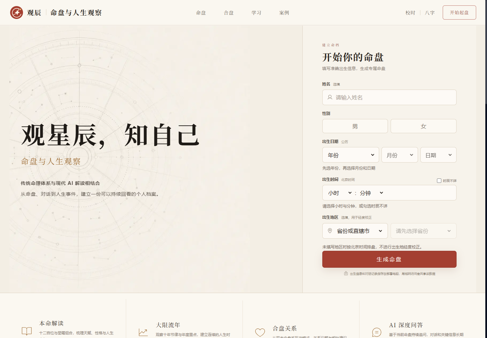
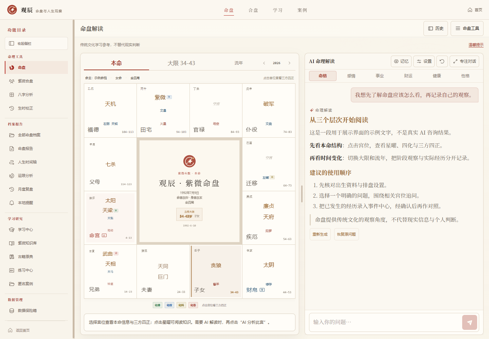
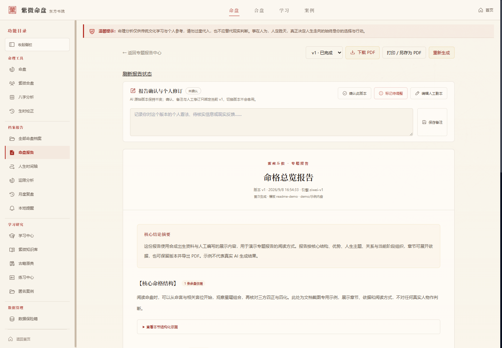
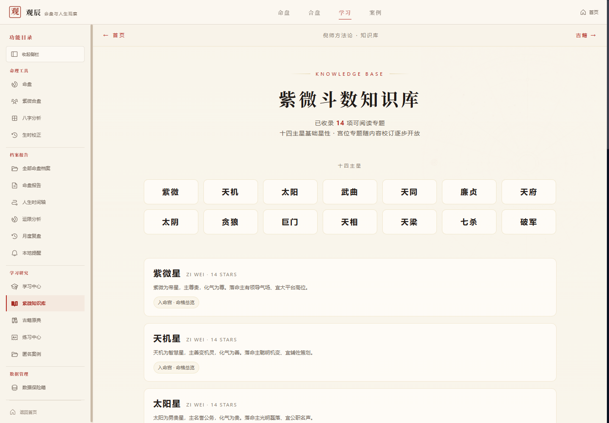

# 观辰 · 命盘与人生观察

**观星辰，知自己。**

当前稳定版本：**v1.0.0**。默认开发与使用分支为 `main`；需要固定版本时使用 `git checkout v1.0.0`。验收结果、升级回退与已知边界见 [v1 发布记录](docs/V1_RELEASE.md)。

观辰是面向个人与可信局域网的命理研究工作台，将紫微排盘、AI 对话、人生事件、运限时间轴与专题报告放在同一个工作空间中，并提供合盘、八字、生时校正与学习功能。

## 项目和数据来源说明
本项目基于ziwei-doushu进行二次开发，项目地址为：https://github.com/Renhuai123/ziwei-doushu

本项目使用了 紫微斗数开源样本数据集 v3.0（518,400 条） 来源：https://github.com/Renhuai123/ziwei-doushu 作者：王多鱼AI

## 界面预览

以下为观辰当前开发版本的实际页面截图。命盘使用合成出生资料，聊天和报告使用人工编写的展示内容，不包含真实用户档案，也不代表真实 AI 生成结果。点击图片可查看原图。

### 首页与出生资料录入

从首页建立命档，填写出生资料后进入命盘工作台。



### 命盘与 AI 对话

左侧查看十二宫和运限，右侧持续提问；可调整分栏，并设置聊天阅读偏好。



### 专题报告阅读

查看摘要、章节与依据，切换报告版本，添加个人修订或下载 PDF。图中是网页阅读样式，PDF 使用独立的白底深色排版。



### 紫微知识库

按主星浏览已收录专题，结合命盘继续查阅基础知识。



## 项目如何使用

典型流程是：

1. 录入出生资料，生成并保存命盘。
2. 查看宫位、星曜与运限，在命盘右侧向 AI 提问。
3. 从历史档案重新进入，继续对话和整理人生事件。
4. 核对并确认事件，将现实经历与年度、流月、流日分析对照。
5. 生成专题报告，查看章节依据，保留版本、添加人工修订并导出 PDF。
6. 结合学习、案例和月度复盘，持续记录需要验证的观察。

排盘和运限事实由程序计算，AI 负责解释与组织内容。用户确认的经历与命理推断分开处理，结构对应不等于现实因果。

## 已有功能

| 模块 | 当前能力 |
| --- | --- |
| 紫微命盘 | 出生资料录入、真太阳时相关设置、十二宫与星曜、四化、三方四正、本命与运限查看 |
| AI 对话 | 流式回复、历史持久化、上下文管理、连续追问、宫位及运限相关解读 |
| 聊天体验 | 可拖动分栏、专注对话、输入区域自适应、紧凑布局、字号与聊天偏好设置、Markdown 表格和代码渲染 |
| 历史档案 | 保存命盘与会话、检索和分页、重新打开、重命名与删除 |
| 人生事件 | 事件录入、候选核对、用户确认、日期精度保留、时间轴及运限关联 |
| 专题报告 | 命格总览、性格与天赋、事业发展、感情婚姻、财富模式、健康关注、当前大限七类报告 |
| 报告管理 | 章节依据、版本保留与对比、失败恢复、用户确认及人工修订、服务端 PDF 导出 |
| 合盘 | 双命盘与关系背景、互动结构分析、关系报告；双方当前阶段按同一北京时间和农历虚岁刷新，指定年度单独按代表日计算 |
| 八字 | 排盘、历史资料、AI 解读、大运及年/月/日相关分析；默认流年按立春区间定位，流日遵循排期与晚子时口径 |
| 生时校正 | 候选时辰、现实事件核对、评估与报告；早晚子时有明确时间标识 |
| 学习与复盘 | 知识和古籍浏览、搜索、课程与练习、案例、提醒与月度复盘 |
| 数据管理 | 整库备份恢复、加密备份导出、单命盘导入导出 |

以上是已具备的功能入口与实现范围，不表示所有真实使用场景均已完成最终验收。

## 最近完成的改进

### 连续追问与自然语言年度分析

- 对“继续说说”“具体怎么做”等省略式追问，沿用此前的宫位、主题或指定运限范围。
- 支持常见明确年份、“今年”“明年”“后年”等年度提问，以及最多三个年份的比较。
- 相对年份依据原问题的北京时间年度解释，避免跨年后重新打开时发生日期漂移。
- 含糊日期、超范围年份和复杂月日表达先澄清；精确流月、流日仍可通过运限入口选择日期。

### 事件与运势关联

- 年度分析按正式事件日期筛选已确认记录，跨年事件按覆盖范围关联。
- 流月使用程序计算的农历月起止日期，流日使用目标公历日期。
- 仅知年份的事件不会被当作某一天的经历；仅知公历月份的记录与流月部分重叠时，会提示日期不确定。
- 检索结果只代表当前选中的相关记录，不代表用户完整经历。

### 专题报告质量检查

- 网页与 PDF 展示本版分析范围，区分命盘事实、程序规则和用户确认记录；事件起止日期、精度及星曜四化可查看。旧版本缺少范围时明确说明，不补写历史。

- 命盘、新报告和单盘 AI 当前阶段统一采用农历虚岁，按北京时间春节换岁；重新打开旧命盘时刷新阶段。
- 事件按专题相关性筛选，当前大限报告按阶段日期关联；新报告事实中记录筛选数量、范围与日期精度。

- 检查章节完整性、章节唯一性和证据引用是否存在。
- 拦截整段重复正文，以及正文直接重复摘要的情况。
- 无引用的推断必须明确标注“综合观察”，报告需要包含行动建议。
- 内容校验失败时自动修正一次，仍失败则保留旧的完成版本；修正会增加一次 AI 调用的耗时与用量。
- 这些检查不能替代语义判断，不能保证所有引用都支持结论，也不能识别所有换词重复和空泛表达。

### PDF 清晰度

- 纯白背景、深色文字，正文 12 磅，依据详情 10 磅，标题使用粗体。
- 元信息按内容换行，优化摘要跨页和章节标题布局。
- 服务端生成可缩放的矢量文字 PDF，嵌入中文字体。
- 新样式适用于公用导出器覆盖的专题、合盘、年度与校时报告。旧报告重新点击“导出 PDF”即可使用新版排版，无需重新调用 AI；已下载的旧文件不会自动改变。

## 技术结构

| 层级 | 技术 |
| --- | --- |
| 应用 | Next.js 15 App Router、React 19、TypeScript |
| 界面 | Tailwind CSS、Framer Motion |
| 本地持久化 | SQLite、better-sqlite3；当前数据库架构 v47 |
| 排盘与历法 | 项目内计算逻辑、iztro、lunar-javascript |
| AI 接入 | 服务端调用 OpenAI 兼容协议；现有 DeepSeek 与 MIMO 配置入口 |
| Markdown | react-markdown、remark-gfm 等 |
| PDF | PDFKit 与可嵌入中文字体 |
| 检查 | scripts 下的 TypeScript/Node 回归脚本、类型检查、生产构建 |

前端、服务端 API 与数据库逻辑在同一项目中，无需另起一套后端。当前验证环境为 Windows、Node.js 24；其他系统需自行满足 SQLite 原生依赖和中文字体条件。

## 安装与启动

首次安装需要 Node.js、npm、Git 和可下载依赖的网络。建议使用当前已验证的 Node.js 24。

```powershell
git clone https://github.com/YKkksss/GuanChen.git
cd GuanChen
git switch main
npm ci
Copy-Item .env.example .env.local
```

首次创建配置后，编辑 `.env.local` 填入自己的供应商配置。已有配置时不要再次复制覆盖，不要将密钥提交到仓库。

```dotenv
AI_PROVIDER=deepseek
DEEPSEEK_API_KEY=填写自己的密钥
NEXT_PUBLIC_SITE_URL=http://localhost:30001
```

启动开发服务：

```powershell
npm run dev
```

浏览器访问 **http://localhost:30001**。

| 使用方式 | 命令 | 监听范围 |
| --- | --- | --- |
| 开发运行 | `npm run dev` | 本机与局域网，端口 30001 |
| 仅本机开发 | `npm run dev:local` | 127.0.0.1:30001 |
| Webpack 开发入口 | `npm run dev:webpack` | 本机与局域网，端口 30001 |
| 生产构建 | `npm run build` | 生成生产文件 |
| 生产运行 | `npm start` | 本机与局域网，端口 30001 |
| 仅本机生产运行 | `npm run start:local` | 127.0.0.1:30001 |

生产运行前先停止开发服务，完成 `npm run build` 后再执行 `npm start`。不要在同一个工作目录同时运行开发服务与生产构建。

当前版本需要可持久保存文件的 Node.js 主机，用于 SQLite、备份与 PDF 导出。已移除遗留 Cloudflare Pages 适配器、`build:cf` / `preview:cf` 命令以及未使用的 Vercel CLI。部署请使用上述 Node.js 命令；迁移到无服务器平台前需要另行设计存储与备份方案。Next.js 的 PostCSS 通过同主版本补丁覆盖保持安全更新。

### 局域网访问

默认启动命令监听 `0.0.0.0:30001`。其他设备通过 `http://部署电脑的局域网IPv4地址:30001` 访问；部署电脑需保持运行，设备网络互通，防火墙允许该端口。

`0.0.0.0` 是监听地址，不是另一台设备应输入的访问地址。局域网设备使用同一份部署数据，当前没有多用户账号隔离；请仅提供给可信设备使用。

## 配置说明

完整示例见 [.env.example](.env.example)。常用选项如下：

| 变量 | 用途与默认值 |
| --- | --- |
| `AI_PROVIDER` | 默认 `deepseek`；使用 MIMO 配置入口时设为 `mimo` |
| `DEEPSEEK_API_KEY` | DeepSeek 入口密钥 |
| `DEEPSEEK_BASE_URL` | 默认 `https://api.deepseek.com` |
| `DEEPSEEK_MODEL` | 默认 `deepseek-chat`，按供应商实际可用模型配置 |
| `MIMO_API_KEY` / `MIMO_BASE_URL` / `MIMO_MODEL` | 使用 MIMO 入口时填写完整配置 |
| `NEXT_PUBLIC_SITE_URL` | 站点地址，本地示例为 `http://localhost:30001` |
| `NEXT_ALLOWED_DEV_ORIGINS` | 额外开发访问域名，多个值以逗号分隔 |
| `SQLITE_PATH` | 默认 `data/ziweidoushu.sqlite` |
| `REPORT_EXPORT_DIR` | 默认 `data/report-exports` |
| `REPORT_PDF_FONT_PATH` | 自定义可嵌入中文常规字体文件 |
| `REPORT_PDF_BOLD_FONT_PATH` | 自定义可嵌入中文粗体字体文件 |
| `AI_CONTEXT_LIMIT` / `AI_INPUT_TOKEN_TARGET` | 对话上下文窗口与日常输入目标 |
| `AI_OUTPUT_RESERVE` / `AI_CONTEXT_SAFETY_MARGIN` | 对话上下文预算预留 |

字体建议分别配置静态常规体与粗体，避免两项均指向默认字重偏细的可变字体。Windows 默认尝试等线常规/粗体；项目内字体和自定义配置优先。Linux 或其他环境缺少中文字体时，需安装字体或显式填写路径。

其他兼容协议供应商是否可用取决于其接口和参数实现，当前不承诺任意供应商直接兼容。

## 数据保存与使用边界

- 命盘、会话、事件和报告主要保存在部署电脑的 SQLite 中，PDF 文件另行保存；浏览器中的主题与聊天偏好不等同于服务端档案。
- 排盘计算不依赖 AI 密钥；AI 对话和报告生成需要有效的供应商配置与网络。
- AI 请求会发送完成当前任务所需的命盘上下文、对话，以及相关记忆或事件给配置的供应商，因此 AI 功能不是完全离线处理。
- 数据库及普通备份默认不加密；密码加密导出只保护该导出文件，不会为运行中的数据库加密。
- 默认 HTTP 不提供传输加密，HTTPS 由部署者配置。项目未默认加载第三方访问统计，搜索引擎不索引声明也不等同于访问控制。
- 删除档案不会删除已经下载的 PDF、备份或其他副本。

命理与 AI 内容用于传统文化学习、自我观察和回顾，不代替医疗、投资、法律、婚姻等专业判断。

## 备份与升级

1. 更新前，在“数据保险箱”生成并下载备份，保存到部署目录之外；需要保护备份内容时选择加密导出并妥善保存密码。
2. 停止服务，保留 `.env.local`、整个数据目录及自定义数据库/导出目录。不要只复制正在写入的 SQLite 主文件。
3. 记录当前提交，更新目标代码，执行 `npm ci` 与 `npm run build`，随后启动服务。数据库会执行所需迁移。
4. 核对历史命盘、对话、事件和报告。恢复备份时先查看预检结果，再确认整库替换。
5. 如果升级后无法正常启动，在独立目录使用兼容代码和升级前备份恢复，避免旧代码直接读写已经迁移的数据库。

自动备份依赖应用运行，不能替代独立保存的副本。当前保留既有数据管理功能，暂不继续扩展备份模块。

## 目录导航

```text
app/          页面、路由与服务端 API
components/   命盘、聊天、事件、报告等界面组件
hooks/        前端状态与交互逻辑
lib/          排盘、AI、上下文、数据库与各业务模块
scripts/      回归检查与开发辅助脚本
docs/         开发规划、设计说明、验收与 AI 交接
public/       静态资源
data/         默认本地数据与导出目录，不作为源码资料传播
```

与近期开发直接相关的代码：

- [AI 上下文](lib/context)：主题、连续追问、日期意图及事实组织。
- [事件服务](lib/events)：事件日期与运限时段匹配。
- [专题报告](lib/reports)：报告类型、证据、生成与质量校验。
- [PDF 导出](lib/report-exports)：导出来源、文件生成与排版。
- [数据库](lib/db)：持久化、版本与数据访问。

## 开发检查

回归脚本按模块拆分，完整命令见 [package.json](package.json)。近期相关检查：

```powershell
npm run test:ziwei-followup
npm run test:natural-transit
npm run test:event-year-context
npm run test:event-period-context
npm run test:report-evidence
npm run test:report-facts
npm run test:reports
npm run test:heming-reports
npm run test:report-comparisons
npm run test:report-revisions
npm run test:report-pdf
npx tsc --noEmit
```

验证应使用独立 SQLite、合成出生资料和本地 AI 模拟响应，避免改动真实档案或消耗真实供应商用量。生产构建与浏览器/实机验收另行执行；自动测试通过不代表真实模型内容质量或全部设备体验已经验收。

## v1 当前状态

网页端本轮规划开发与自动回归已收尾，77 项检查通过。当前是待使用验收的发布候选，尚未正式冻结、未创建 v1.0.0 标签。完整记录、阶段提交和验收限制见 [v1 发布候选记录](docs/V1_RELEASE_CANDIDATE.md)。

```powershell
npm run test:v1-all
```

该命令逐项执行现有回归，使用独立临时数据目录并保存检查日志。完整网页使用链路、真实 AI 表达质量、真实手机与另一台局域网主机验收通过后，再保留发布备份、确定发布提交并冻结版本。此前不扩展新模块；备份扩展继续暂停。

暂不纳入 v1 的内容包括公网多用户账号与支付、跨设备独立同步、新供应商深度适配，以及奇门、六爻、梅花、择日等新模块。

已知限制：进程退出后不保证 AI 生成继续执行；应用未运行时不保证提醒送达；知识内容仍有简版与未收录项；自然语言日期解析采用保守规则，不支持任意复杂表达。

## 开发文档

- [v1 固定范围与验收清单](docs/V1_FREEZE_SCOPE.md)
- [产品模块开发路线](docs/PRODUCT_MODULE_DEVELOPMENT_ROADMAP.md)
- [AI 对话持久化与上下文设计](docs/AI_CONTEXT_MANAGEMENT_DESIGN.md)
- [2026-09-05 交接基线](docs/AI交接文档/交接文档-2026-09-05.md)
- [2026-09-07 功能推进记录](docs/AI交接文档/交接文档-2026-09-07.md)
- [2026-09-08 PDF 清晰度改进](docs/AI交接文档/交接文档-2026-09-08.md)

旧文档中的阶段计划可能早于当前决策，开发顺序以 v1 范围文档的最新优先级和近期交接记录为准。

## 来源与许可

项目在 [Renhuai123/ziwei-doushu](https://github.com/Renhuai123/ziwei-doushu) 基础上继续开发，上游作者为王多鱼AI。排盘依赖包括 iztro 与 lunar-javascript，项目还包含古籍及知识资料。

代码许可见 [LICENSE](LICENSE)，保留原版权声明。依赖、古籍资料及外部数据分别遵守其适用许可。

上游另行发布的“紫微斗数开源样本数据集 v3.0（518,400 条）”不是运行本工作台所必需的安装数据。如使用该数据集，请保留来源、作者及数据集名称，并遵守随数据提供的许可与来源标注要求。
