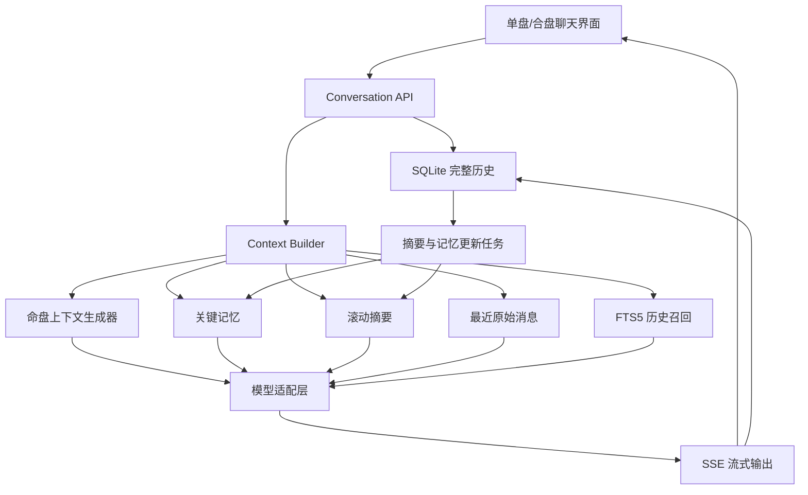

# 紫微斗数 AI 对话持久化与上下文管理设计

> 文档状态：设计定稿，Context Management v1 已实施（单盘）  
> 适用范围：本地单机部署、SQLite、单盘解读与双人合盘  
> 编写日期：2026-08-12  
> 目标版本：Context Management v1

> 实施进度（2026-08-13）：阶段一至阶段四已完成；阶段五“合盘统一”留待 M4 合盘模块实施。

---

## 1. 文档目的

本文定义紫微斗数项目的本地对话持久化、长对话上下文管理、摘要压缩、关键记忆、历史召回和模型调用规范。

该方案解决以下问题：

1. 起盘或合盘后刷新页面，命盘和聊天记录丢失。
2. 对话轮次增长后，发送给模型的上下文无限增长。
3. 仅保留最近若干轮时，模型遗忘较早的重要信息。
4. AI 之前的推断可能被后续模型误认为用户已经确认的事实。
5. 完整命盘 JSON、专题提示词和历史消息被重复发送，造成 Token 浪费。
6. 不同模型供应商的会话状态、上下文窗口和缓存能力不一致。
7. 流式回答被中断时，已经生成的内容无法恢复。

本方案明确区分：

- **持久化历史**：SQLite 中永久保存的完整事实来源。
- **模型上下文**：每次请求时，从历史中筛选和压缩得到的临时工作集。
- **提示缓存**：供应商对重复前缀的计算缓存，只优化成本与延迟，不等于记忆。

---

## 2. 实施前项目现状（留档）

本节记录方案实施前的问题基线，便于对照改造效果；当前实现状态以第 30 节为准。

### 2.1 当前单盘流程

当前单盘页面由以下部分组成：

- app/chart/page.tsx：使用 React 状态保存当前命盘。
- components/InsightPanel.tsx：使用 React 状态保存消息。
- lib/ziwei/algorithm.ts：根据出生信息生成命盘。
- app/api/interpret/route.ts：接收命盘和消息，调用 AI。
- lib/ai/deepseek.ts：适配 OpenAI 兼容的流式接口。

当前解释接口只保留前端传入消息的最后 8 条：

    normalizeMessages(incoming).slice(-8)

这大约只相当于 4 轮用户与助手对话，而且没有摘要、关键事实或历史检索。

### 2.2 当前合盘流程

app/heming/page.tsx 在浏览器内存中保存：

- 甲方命盘
- 乙方命盘
- 当前问题
- AI 合盘结果

刷新后这些数据全部丢失。

### 2.3 当前数据特征

本项目与普通聊天应用不同，存在四类上下文：

1. **不可由模型改写的命盘事实**
   - 出生信息
   - 十二宫
   - 星曜
   - 四化
   - 大限
   - 空宫借对宫

2. **用户确认的现实信息**
   - 职业状态
   - 婚姻状态
   - 已发生的人生事件
   - 用户对出生时间的修正

3. **AI 历史解读**
   - 以前对事业、感情、健康等主题的分析
   - 以前给出的建议和待验证判断

4. **对话控制信息**
   - 当前主题
   - 点击的宫位
   - 点击的四化
   - 单盘或合盘
   - 流式生成状态

这四类数据必须分开管理。

---

## 3. 主流方案调研结论

### 3.1 OpenAI

OpenAI 官方提供手工传递历史、Responses API 的 previous_response_id，以及 Conversations API 等会话状态方式。

需要注意：

- 使用服务端会话标识不代表旧 Token 免费。
- 即使使用 previous_response_id，历史输入仍会计入后续请求的输入 Token。
- 会话状态持久化不能自动解决长上下文质量下降。
- 提示缓存要求尽量保持相同的前缀，静态内容应放在前面，变量内容放在后面。

参考：

- [OpenAI Conversation state](https://developers.openai.com/api/docs/guides/conversation-state)
- [OpenAI Prompt caching](https://developers.openai.com/api/docs/guides/prompt-caching)

### 3.2 Anthropic Claude

Anthropic 官方文档明确指出：

- 上下文是模型的工作记忆。
- 上下文越长并不自动意味着效果越好。
- 长上下文可能出现注意力和召回质量下降。
- 长对话应使用 compaction，将较早内容压缩为摘要。
- Prompt caching 只减少重复前缀的成本和延迟，缓存内容仍然占用上下文窗口。

参考：

- [Claude Context windows](https://platform.claude.com/docs/en/build-with-claude/context-windows)
- [Claude Compaction](https://platform.claude.com/docs/en/build-with-claude/compaction)
- [Claude Prompt caching](https://platform.claude.com/docs/en/build-with-claude/prompt-caching)

### 3.3 DeepSeek

DeepSeek 官方说明 Chat Completions API 是无状态接口，应用需要自行拼接多轮消息。

DeepSeek 的上下文缓存可复用相同请求前缀，但：

- 缓存不等于持久化历史。
- 缓存不等于上下文压缩。
- 缓存命中要求前缀保持一致。
- 历史仍然需要应用自己保存和筛选。

参考：

- [DeepSeek Multi-round Conversation](https://api-docs.deepseek.com/guides/multi_round_chat)
- [DeepSeek Context Caching](https://api-docs.deepseek.com/guides/kv_cache)

### 3.4 LangGraph

LangGraph 将记忆划分为：

- 线程级短期记忆：当前会话的状态与消息。
- 长期记忆：跨会话或应用级的事实、偏好和经验。

其官方方案包括：

- 截断消息
- 删除旧消息
- 滚动摘要
- 数据库检查点
- 语义检索

参考：

- [LangGraph Memory](https://docs.langchain.com/oss/javascript/langgraph/add-memory)
- [LangGraph Memory overview](https://docs.langchain.com/oss/javascript/concepts/memory)

### 3.5 Vercel AI SDK

Vercel AI SDK 推荐：

- 每个聊天拥有稳定的 chat ID。
- 路由使用 /chat/[id] 形式。
- 前端展示消息与模型消息分离。
- 流式输出完成后持久化完整消息。
- 从存储恢复消息时进行结构校验。

参考：

- [AI SDK Chatbot Message Persistence](https://ai-sdk.dev/docs/ai-sdk-ui/chatbot-message-persistence)

### 3.6 调研结论

适合本项目的主流组合不是“无限发送完整历史”，而是：

    完整历史持久化
    + 最近消息窗口
    + 增量摘要
    + 结构化关键记忆
    + 按需历史召回
    + 动态 Token 预算
    + 稳定提示前缀

---

## 4. 设计原则

### 4.1 SQLite 是事实来源

所有原始消息、命盘快照和摘要版本永久保存在 SQLite。

摘要只是一种可重建的派生数据，不得替代或删除原始消息。

### 4.2 模型上下文是临时工作集

每次调用模型前，由 Context Builder 动态组装上下文。不得直接把数据库中的全部历史发送给模型。

### 4.3 Token 预算优先于固定轮数

“最近 5 轮”或“最近 10 轮”只能作为参考。

真正的裁剪依据是：

- 模型上下文上限
- 预留输出 Token
- 固定提示占用
- 命盘上下文占用
- 最近消息实际长度

### 4.4 命盘事实与 AI 推断严格隔离

命盘数据由程序计算，是权威事实。

用户现实信息必须来自用户明确陈述。

AI 历史解读只能标记为“此前模型判断”，不能升级为现实事实。

### 4.5 供应商无关

本地数据库和上下文构建不能依赖某一家模型的服务端会话状态。

OpenAI、Claude、DeepSeek 或其他 OpenAI 兼容模型都应接收同一套应用层上下文。

### 4.6 缓存与压缩分离

- 压缩解决上下文长度和注意力质量问题。
- 缓存解决重复前缀成本与延迟问题。

两者必须分别设计。

---

## 5. 总体架构

说明：

- 完整对话始终在 SQLite 中。
- Context Builder 只读取本次请求需要的内容。
- AI 流式回答边展示边分批写入数据库。
- 回答完成后更新摘要和关键记忆。

---

## 6. SQLite 数据模型

### 6.1 conversations

    CREATE TABLE conversations (
      id TEXT PRIMARY KEY,
      type TEXT NOT NULL CHECK (type IN ('chart', 'heming')),
      title TEXT NOT NULL,
      status TEXT NOT NULL DEFAULT 'active'
        CHECK (status IN ('active', 'archived')),

      birth_info_json TEXT,
      chart_snapshot_json TEXT,
      birth_info_a_json TEXT,
      birth_info_b_json TEXT,
      chart_snapshot_a_json TEXT,
      chart_snapshot_b_json TEXT,

      engine_version TEXT NOT NULL,
      prompt_version TEXT NOT NULL,

      summary_json TEXT,
      summary_through_seq INTEGER NOT NULL DEFAULT 0,
      summary_version INTEGER NOT NULL DEFAULT 1,
      summary_updated_at INTEGER,

      last_message_seq INTEGER NOT NULL DEFAULT 0,
      created_at INTEGER NOT NULL,
      updated_at INTEGER NOT NULL
    );

### 6.2 messages

    CREATE TABLE messages (
      id TEXT PRIMARY KEY,
      conversation_id TEXT NOT NULL,
      seq INTEGER NOT NULL,
      role TEXT NOT NULL
        CHECK (role IN ('user', 'assistant', 'system')),
      content TEXT NOT NULL DEFAULT '',

      source TEXT NOT NULL DEFAULT 'question',
      topic TEXT,
      palace_branch INTEGER,
      sihua_type TEXT,
      metadata_json TEXT,

      status TEXT NOT NULL DEFAULT 'completed'
        CHECK (status IN ('pending', 'streaming', 'completed', 'failed', 'cancelled')),

      token_count INTEGER NOT NULL DEFAULT 0,
      provider_message_id TEXT,
      provider_response_id TEXT,
      error_code TEXT,
      created_at INTEGER NOT NULL,
      updated_at INTEGER NOT NULL,

      UNIQUE (conversation_id, seq),
      FOREIGN KEY (conversation_id)
        REFERENCES conversations(id)
        ON DELETE CASCADE
    );

### 6.3 memory_items

    CREATE TABLE memory_items (
      id TEXT PRIMARY KEY,
      conversation_id TEXT NOT NULL,
      category TEXT NOT NULL
        CHECK (category IN (
          'user_fact',
          'confirmed_event',
          'user_preference',
          'correction',
          'open_question',
          'previous_interpretation'
        )),
      content TEXT NOT NULL,
      normalized_key TEXT,
      source_message_id TEXT,
      confidence REAL NOT NULL DEFAULT 1.0,
      status TEXT NOT NULL DEFAULT 'active'
        CHECK (status IN ('active', 'superseded', 'deleted')),
      created_at INTEGER NOT NULL,
      updated_at INTEGER NOT NULL,

      FOREIGN KEY (conversation_id)
        REFERENCES conversations(id)
        ON DELETE CASCADE,
      FOREIGN KEY (source_message_id)
        REFERENCES messages(id)
        ON DELETE SET NULL
    );

### 6.4 context_runs

用于诊断上下文组装和模型调用。

    CREATE TABLE context_runs (
      id TEXT PRIMARY KEY,
      conversation_id TEXT NOT NULL,
      trigger_message_id TEXT NOT NULL,
      provider TEXT NOT NULL,
      model TEXT NOT NULL,

      context_limit INTEGER NOT NULL,
      output_reserve INTEGER NOT NULL,
      input_budget INTEGER NOT NULL,
      estimated_input_tokens INTEGER NOT NULL,
      actual_input_tokens INTEGER,
      actual_output_tokens INTEGER,
      cached_input_tokens INTEGER,

      summary_version INTEGER,
      recent_message_start_seq INTEGER,
      recent_message_count INTEGER,
      retrieved_message_ids_json TEXT,
      context_manifest_json TEXT,

      created_at INTEGER NOT NULL,
      completed_at INTEGER,

      FOREIGN KEY (conversation_id)
        REFERENCES conversations(id)
        ON DELETE CASCADE
    );

### 6.5 FTS5 历史搜索

    CREATE VIRTUAL TABLE messages_fts USING fts5(
      message_id UNINDEXED,
      conversation_id UNINDEXED,
      content,
      tokenize = 'unicode61'
    );

第一版 FTS5 用于关键词召回。中文分词能力有限，因此查询策略同时支持：

- 精确子字符串匹配
- FTS5 关键词匹配
- 时间和主题过滤

第一版不引入向量数据库。

参考：[SQLite FTS5](https://www.sqlite.org/fts5.html)

### 6.6 数据库运行配置

数据库启动时执行：

    PRAGMA foreign_keys = ON;
    PRAGMA journal_mode = WAL;
    PRAGMA synchronous = NORMAL;
    PRAGMA busy_timeout = 5000;

数据库文件建议：

    data/ziweidoushu.sqlite

同时忽略：

    data/*.sqlite
    data/*.sqlite-shm
    data/*.sqlite-wal
    data/backups/

---

## 7. 消息与会话语义

### 7.1 一轮对话

一轮定义为：

    一条用户消息
    + 与之对应的一条助手消息

专题按钮、宫位点击和四化点击不应保存整段隐藏提示词，只保存结构化事件。

例如：

    {
      "source": "topic",
      "topic": "career",
      "displayText": "分析事业运"
    }

服务端根据 topic 加载对应模板。

### 7.2 会话类型

- chart：一张命盘对应一个会话。
- heming：两张命盘对应一个会话。

同一张命盘可以建立多个会话，但第一版默认“一次起盘一个会话”。

### 7.3 会话标题

自动标题优先级：

1. 姓名 + 出生日期
2. 出生日期 + 首个分析主题
3. 创建日期 + 命盘类型

允许用户手动重命名。

---

## 8. 分层上下文模型

每次模型请求按照以下层次组装。

### L0：系统与安全规则

内容：

- 模型角色
- 禁止绝对化断言
- 健康、投资、法律免责声明
- 不得把 AI 推断当成现实事实
- 当前输出格式

属性：

- 静态
- 版本化
- 放在提示最前方
- 适合提示缓存

### L1：命盘权威事实

内容：

- 出生信息
- 命宫、身宫、五行局
- 十二宫主星与本命四化
- 当前大限
- 空宫借对宫

属性：

- 由程序生成
- 不经过 LLM 摘要
- 不接受普通对话消息覆盖
- 命盘修改必须通过明确的重新起盘操作

### L2：与当前主题有关的命盘详情

根据问题动态选择。

| 当前主题 | 必选宫位 |
|---|---|
| 命格 | 命宫、财帛、官禄、迁移 |
| 性格 | 命宫、福德、迁移、交友 |
| 感情 | 夫妻、命宫、福德、迁移 |
| 事业 | 官禄、财帛、命宫、迁移 |
| 财运 | 财帛、田宅、官禄、福德 |
| 健康 | 疾厄、命宫、福德、父母 |
| 合盘 | 双方命宫、夫妻、福德、迁移、交友 |
| 宫位点击 | 本宫、对宫、两个三合宫 |

详细上下文可包含：

- 辅星
- 煞星
- 星曜亮度
- 相关格局
- 当前流年或大限叠加

### L3：结构化关键记忆

包括：

- 用户确认的现实事实
- 已发生事件
- 用户偏好
- 修正信息
- 未解决的问题
- 此前模型解读

其中 previous_interpretation 必须带明显标签：

    以下是此前模型的分析记录，不是用户确认的现实事实。

### L4：滚动摘要

摘要覆盖较早对话，只保留对当前会话仍有价值的信息。

摘要不得包含：

- 完整命盘 JSON
- 重复的系统提示词
- 大段助手原文
- 未标注来源的推测

### L5：按需召回的旧消息

根据当前问题，从已摘要的历史中召回最多 2 到 4 个片段。

召回优先级：

1. 用户明确引用“之前”“上次”“刚才”。
2. 当前问题含有过去出现过的人名、年份、事件或主题。
3. 当前问题与 open_question 匹配。
4. 当前问题与旧消息关键词匹配。

### L6：最近原始消息

保留最近原文，维持语言细节、指代关系和当前讨论方向。

默认策略：

- 目标：最近 6 轮。
- 最少：4 轮。
- 最多：10 轮。
- Token 上限：由动态预算决定。

### L7：当前请求

当前用户消息永远完整保留，不参与摘要或裁剪。

---

## 9. 动态 Token 预算

### 9.1 预算公式

    inputBudget =
      modelContextLimit
      - outputReserve
      - safetyMargin

建议：

- outputReserve：模型最大输出 Token + 推理预留。
- safetyMargin：上下文上限的 5% 或固定 1000 Token，取较大值。
- 不以供应商宣传的最大上下文作为日常目标。

### 9.2 输入预算分配

默认按比例分配：

| 层次 | 预算比例 | 裁剪策略 |
|---|---:|---|
| L0 系统规则 | 10% | 不裁剪 |
| L1 命盘基础事实 | 20% | 使用紧凑结构 |
| L2 专题命盘详情 | 15% | 仅保留相关宫位 |
| L3 关键记忆 | 10% | 按状态和相关性排序 |
| L4 滚动摘要 | 10% | 控制摘要长度 |
| L5 历史召回 | 10% | 限制片段数 |
| L6 最近消息 | 25% | 从旧到新动态裁剪 |

实际实现可以允许未用完预算流向 L6 最近消息。

### 9.3 第一版建议值

第一版不依赖模型拥有超大上下文，使用保守工作集：

- 日常输入目标：不超过 12K Token。
- 输出预留：约 2K 到 3K Token。
- 命盘基础事实：约 1.5K 到 2.5K Token。
- 滚动摘要：不超过 1K Token。
- 关键记忆：不超过 1K Token。
- 历史召回：不超过 1.5K Token。
- 最近消息：使用剩余预算，通常为 4 到 8 轮。

这些是应用预算，不是模型硬上限。

### 9.4 Token 计算

优先级：

1. 使用供应商提供的 Token 计数接口或兼容 tokenizer。
2. 使用模型响应 usage 记录实际 Token。
3. 无 tokenizer 时使用保守估算。

每条消息保存 token_count，避免每次重算全部历史。

---

## 10. 上下文组装算法

    async function buildContext(conversationId, currentMessage) {
      const conversation = await loadConversation(conversationId);
      const profile = getModelProfile();

      const system = buildSystemPrompt(conversation.promptVersion);
      const chartBase = buildCompactChartContext(conversation);
      const topic = classifyTopic(currentMessage);
      const chartDetails = buildTopicChartContext(conversation, topic);

      const memories = await loadRelevantMemories(
        conversationId,
        currentMessage
      );

      const summary = parseSummary(conversation.summaryJson);
      const retrieved = await retrieveOlderMessages(
        conversationId,
        currentMessage,
        conversation.summaryThroughSeq
      );

      let recent = await loadRecentCompletedMessages(
        conversationId,
        10
      );

      const fixedTokens = countTokens([
        system,
        chartBase,
        chartDetails,
        memories,
        summary,
        retrieved,
        currentMessage
      ]);

      const recentBudget =
        profile.inputBudget - fixedTokens;

      recent = trimOldestUntilWithinBudget(
        recent,
        recentBudget,
        { minTurns: 4, maxTurns: 10 }
      );

      return assembleInStableOrder({
        system,
        chartBase,
        chartDetails,
        memories,
        summary,
        retrieved,
        recent,
        currentMessage
      });
    }

### 10.1 稳定顺序

为提高供应商提示缓存命中率，上下文顺序必须稳定：

1. 系统提示词
2. 固定安全规则
3. 命盘基础事实
4. 专题命盘详情
5. 关键记忆
6. 摘要
7. 历史召回
8. 最近消息
9. 当前问题

尽量不要在固定前缀中插入时间戳、随机 ID 或动态文案。

---

## 11. 滚动摘要

### 11.1 触发条件

满足任意条件时触发：

- summary_through_seq 之后累计超过 12 轮。
- 未摘要消息超过 6000 Token。
- 下一次请求预计超过输入预算。
- 用户主动选择“整理当前对话”。

### 11.2 摘要范围

触发时：

- 保留最近 6 轮原文。
- 对更早且尚未摘要的完整轮次进行摘要。
- 不拆分一轮用户与助手消息。
- 不摘要 streaming、failed 或 cancelled 消息。

### 11.3 增量更新

输入：

    旧摘要
    + 新增待摘要消息

输出：

    新摘要

不得每次重新总结全部历史。

### 11.4 摘要结构

    {
      "user_context": [],
      "confirmed_events": [],
      "topics_discussed": [],
      "previous_conclusions": [],
      "corrections": [],
      "open_questions": [],
      "user_preferences": [],
      "disputed_or_uncertain": [],
      "do_not_assume": []
    }

### 11.5 摘要提示规则

摘要模型必须遵守：

1. 只提取输入中出现的信息。
2. 区分用户事实和助手推断。
3. 用户明确纠正时，新信息覆盖旧信息。
4. 被覆盖信息进入 corrections。
5. 无法确定的信息进入 disputed_or_uncertain。
6. 不复制命盘 JSON。
7. 不生成新的命理判断。
8. 输出严格 JSON。

### 11.6 摘要失败

摘要失败时：

- 不更新 summary_through_seq。
- 不影响原始消息。
- 下一次满足条件时重试。
- 模型调用仍可通过减少最近消息完成。

---

## 12. 关键记忆

### 12.1 记忆分类

#### user_fact

用户明确陈述的当前事实。

例如：

    我现在在做互联网产品。

#### confirmed_event

用户确认已经发生的事件。

例如：

    我在 2022 年换过工作。

#### user_preference

用户对回答方式或讨论范围的偏好。

例如：

    回答直接一点，不要重复基础概念。

#### correction

用户对出生信息或先前事实的修正。

例如：

    出生时间不是八点，是七点半。

#### open_question

尚未解决或用户要求以后继续的问题。

#### previous_interpretation

此前模型的判断，必须与用户事实分开。

### 12.2 写入策略

第一版采用后台提取：

1. AI 回答完成。
2. 将本轮用户消息和当前 active memories 发送给记忆提取器。
3. 返回新增、更新、覆盖和忽略操作。
4. 在 SQLite 事务中写入。

### 12.3 冲突处理

相同 normalized_key 出现冲突时：

- 用户新陈述覆盖用户旧陈述。
- AI 推断不能覆盖用户事实。
- 低置信度内容不能覆盖高置信度内容。
- 被覆盖记录状态变为 superseded，不物理删除。

---

## 13. 历史召回

### 13.1 第一版

使用 SQLite FTS5、关键词和结构化过滤。

查询条件包括：

- conversation_id
- 已被摘要的消息范围
- role
- topic
- 年份
- 宫位
- 当前问题关键词

### 13.2 召回排序

综合评分：

    score =
      keywordMatch * 0.45
      + topicMatch * 0.25
      + recency * 0.15
      + userMessageBonus * 0.15

用户原话优先于 AI 旧回答。

### 13.3 去重

不得重复加入：

- 已在最近消息中的内容
- 已完整出现在摘要中的内容
- 同一轮的多个高度重叠片段

### 13.4 第二版可选增强

当单个会话超过数百轮，或需要跨会话搜索时，可以增加向量检索。

第一版不引入 Embedding 和向量数据库，避免不必要复杂度。

---

## 14. 命盘上下文压缩

### 14.1 基础结构

命盘基础上下文采用紧凑 JSON 或固定文本，不使用完整前端对象。

示例：

    {
      "birth": {
        "date": "1990-05-17",
        "hourBranch": "辰",
        "gender": "male"
      },
      "core": {
        "ming": "申",
        "shen": "子",
        "wuxingJu": "木三局",
        "currentDaXian": "32-41 岁，官禄宫"
      },
      "palaces": [
        {
          "name": "命宫",
          "branch": "申",
          "majorStars": ["紫微", "天府"],
          "sihua": ["紫微化科"]
        }
      ]
    }

### 14.2 默认不传递

以下数据除非当前主题需要，否则不传：

- 全部杂曜
- 与问题无关的辅星
- UI 字段
- 动画字段
- 重复的地支索引和中文名
- undefined 字段
- 已经可以从其他字段推导的数据

### 14.3 相关宫位扩展

专题详情由程序确定，不让模型自己猜应该加载哪些宫位。

---

## 15. 流式回答持久化

### 15.1 生命周期

1. 写入用户消息，状态 completed。
2. 创建助手消息，状态 pending。
3. 模型连接成功，状态改为 streaming。
4. SSE 内容实时显示。
5. 每 500 毫秒或每累计一定字符批量更新 SQLite。
6. 收到 DONE 后写入完整内容，状态改为 completed。
7. 记录 usage 和 context_run。

### 15.2 中断恢复

页面刷新时：

- completed：正常显示。
- streaming：显示“上次生成被中断”。
- pending：显示“请求尚未开始或异常退出”。
- failed：显示失败原因和重试按钮。

第一版不自动续写中断回答，用户可以选择：

- 重新生成
- 保留已有部分
- 删除失败回答

### 15.3 写入节流

禁止每个 Token 写一次 SQLite。

推荐：

- 500 毫秒批量写入一次。
- 或累计 200 到 500 个字符后写入。
- 完成时强制最终写入。

---

## 16. API 设计

### 16.1 会话接口

    GET    /api/conversations
    POST   /api/conversations
    GET    /api/conversations/[id]
    PATCH  /api/conversations/[id]
    DELETE /api/conversations/[id]

### 16.2 消息接口

    GET    /api/conversations/[id]/messages
    POST   /api/conversations/[id]/messages
    PATCH  /api/messages/[id]
    DELETE /api/messages/[id]

### 16.3 AI 接口

建议统一为：

    POST /api/conversations/[id]/respond

请求：

    {
      "message": "今年适合换工作吗？",
      "source": "question",
      "topic": "career",
      "palaceBranch": null,
      "sihuaType": null
    }

服务端负责：

1. 校验会话存在。
2. 保存用户消息。
3. 构建上下文。
4. 调用模型。
5. 流式写入助手消息。
6. 更新摘要与记忆。

前端不再上传完整命盘和全部历史。

### 16.4 兼容现有接口

迁移期间保留：

- /api/interpret
- /api/heming

新页面切换完成后再删除旧接口。

---

## 17. 页面与路由

### 17.1 建议路由

    /chart
    /chart/[conversationId]
    /heming
    /heming/[conversationId]
    /history

### 17.2 新建单盘

    /chart
      -> 填写出生信息
      -> 创建 conversation
      -> 保存命盘快照
      -> 跳转 /chart/[id]

### 17.3 恢复历史

    /chart/[id]
      -> 服务端加载 conversation
      -> 加载 messages
      -> 渲染命盘和历史消息

### 17.4 历史列表

支持：

- 按更新时间排序
- 单盘与合盘筛选
- 重命名
- 删除
- 搜索
- 归档

---

## 18. 推荐代码结构

    lib/
      db/
        connection.ts
        migrate.ts
        schema.ts
        conversations.ts
        messages.ts
        memories.ts
        context-runs.ts
        search.ts

      conversation/
        types.ts
        repository.ts
        service.ts
        title.ts

      context/
        builder.ts
        budget.ts
        token-counter.ts
        chart-context.ts
        topic-router.ts
        summary.ts
        memory.ts
        retrieval.ts
        manifest.ts

      ai/
        provider.ts
        deepseek.ts
        prompts/
          system.ts
          topics.ts
          summarizer.ts
          memory-extractor.ts

    app/
      api/
        conversations/
      chart/
        [conversationId]/
      heming/
        [conversationId]/
      history/

数据库模块必须是 server-only，不得被客户端组件导入。

---

## 19. 模型供应商适配

### 19.1 统一能力描述

    interface ModelProfile {
      provider: string;
      model: string;
      contextLimit: number;
      defaultOutputReserve: number;
      supportsPromptCaching: boolean;
      supportsTokenUsage: boolean;
      supportsStructuredOutput: boolean;
      preservesReasoningAcrossTurns: boolean;
    }

### 19.2 不依赖供应商服务端历史

即使 OpenAI 或 Claude 提供服务端会话能力，本项目仍以 SQLite 为权威来源。

原因：

- 本地历史可迁移供应商。
- 可重建任意上下文。
- 可删除、备份和审计。
- 不受供应商保存期限影响。
- 可以进行自己的摘要和召回。

### 19.3 Reasoning 内容

默认不保存或重传模型内部推理内容。

只保存最终可见回答、工具调用和必要元数据。

如果某供应商要求在工具调用链中原样返回 reasoning block，则仅在当前未完成工具调用周期中保留，完成后不进入长期上下文。

---

## 20. 提示缓存

### 20.1 缓存友好的顺序

保持以下前缀稳定：

1. 系统提示词
2. 安全规则
3. 输出格式
4. 命盘基础结构

动态内容放在后面：

- 专题详情
- 摘要
- 记忆
- 最近消息
- 当前问题

### 20.2 注意事项

- 缓存不能降低上下文占用。
- 缓存不能替代摘要。
- 更新 prompt_version 会导致缓存前缀变化。
- 不应为了缓存命中而发送已经无关的旧消息。

---

## 21. 隐私与本地安全

### 21.1 本地部署边界

第一版不设计用户系统，但仍应防止意外暴露：

- 默认只监听 localhost。
- 如果开放局域网，应明确提示所有访问者共享同一历史库。
- API Key 只存环境变量。
- 数据库不得提交 Git。

### 21.2 发送给模型的数据最小化

默认不发送：

- 姓名
- 精确城市
- 不影响命盘的备注

除非用户明确要求模型在回答中使用姓名。

### 21.3 本地数据能力

提供：

- 删除单条会话
- 清空全部历史
- 导出 JSON
- 备份 SQLite
- 恢复备份

---

## 22. 可观测性

每次模型调用记录 context manifest，但不重复保存完整提示文本。

建议记录：

- 使用的模型
- 输入预算
- 实际输入和输出 Token
- 缓存命中 Token
- 摘要版本
- 最近消息范围
- 历史召回消息 ID
- 命盘上下文版本
- 响应耗时
- 停止原因
- 错误码

开发环境可以提供“上下文调试面板”，显示本次请求实际采用了哪些层次和 Token。

---

## 23. 失败与降级策略

| 故障 | 降级行为 |
|---|---|
| SQLite 暂时锁定 | busy_timeout 后重试一次 |
| 摘要失败 | 保留旧摘要，减少最近消息 |
| 记忆提取失败 | 不影响主回答，下轮重试 |
| FTS5 不可用 | 使用 LIKE 子字符串搜索 |
| Token 计数失败 | 使用保守字符估算 |
| 模型上下文超限 | 再次裁剪最老最近消息 |
| AI 流中断 | 保存已生成内容并标记 failed |
| 命盘快照解析失败 | 尝试根据 birth_info 重新排盘 |
| 数据库迁移失败 | 阻止服务启动并提示备份恢复 |

---

## 24. 实施阶段

### 阶段一：SQLite 会话持久化（已完成）

目标：

- 数据库连接与迁移
- conversations 和 messages
- 创建、加载、删除会话
- /chart/[id]
- 刷新恢复命盘和消息
- 流式消息最终持久化

暂不包含：

- 摘要
- 关键记忆
- FTS5

### 阶段二：上下文构建器（已完成）

目标：

- 服务端加载会话和消息
- 命盘紧凑上下文
- 主题相关宫位
- 动态 Token 预算
- 最近消息窗口
- context_runs

### 阶段三：摘要与记忆（已完成）

目标：

- 增量摘要
- 结构化关键记忆
- 冲突和纠正机制
- 流程异步化

### 阶段四：历史召回（已完成）

目标：

- FTS5
- 关键词与主题召回
- 上下文去重
- 调试面板

### 阶段五：合盘统一（M4-1 已完成资料持久化）

目标：

- [x] 合盘会话和双命盘快照
- [ ] 双命盘上下文（M4-3）
- [x] 合盘历史恢复
- [x] 单盘和合盘统一 Conversation Service

---

## 25. 验收标准

### 25.1 持久化

- 起盘后刷新页面，命盘不丢失。
- 对话后刷新页面，消息完整恢复。
- 关闭浏览器后重新访问，历史仍存在。
- 删除会话后，关联消息和记忆级联删除。

### 25.2 流式恢复

- AI 回答中刷新，已生成部分仍可看到。
- 中断消息状态明确。
- 重试不会重复创建用户消息。

### 25.3 上下文

- 前 50 轮原始消息全部保存在 SQLite。
- 模型请求不会携带全部 50 轮。
- 最近 4 轮在任何正常预算下完整保留。
- 重要用户事实在被摘要后仍可被模型使用。
- AI 旧推断不会被标记为用户事实。
- 用户修正信息能够覆盖旧信息。

### 25.4 Token

- context_run 能记录估算和实际 Token。
- 请求输入超过预算前会触发裁剪或摘要。
- 提示结构保持稳定前缀。

### 25.5 历史召回

- 用户询问“之前提到的 2022 年换工作”时，能够召回对应原话。
- 召回内容不会与最近消息重复。

### 25.6 本地安全

- SQLite 文件不进入 Git。
- 前端无法直接读取数据库文件。
- API Key 不写入数据库。
- 默认不向模型发送姓名和城市。

---

## 26. 测试策略

### 单元测试

- Token 预算分配
- 最近消息按完整轮次裁剪
- 摘要范围计算
- 命盘专题宫位选择
- 记忆冲突处理
- 上下文顺序稳定

### 集成测试

- 创建会话到刷新恢复
- 流式消息状态变化
- SQLite 事务回滚
- 级联删除
- 摘要更新 summary_through_seq
- FTS5 召回

### 长对话测试

构造至少 100 轮对话，验证：

- 数据库完整保存
- 输入上下文保持在预算内
- 较早重要事实仍能召回
- 最近指代关系不丢失
- 摘要不会把 AI 推断当作用户事实

### 回归测试

- 现有单盘排盘结果不变
- 现有合盘结果可正常流式输出
- 亮色和暗色主题不受影响
- 端口 30001 启动正常

---

## 27. 已确定的架构决策

### ADR-001：使用 SQLite

理由：本地单机部署、零运维、可备份、跨浏览器共享。

### ADR-002：完整历史不删除

理由：摘要会损失信息，原始历史必须可追溯和重建。

### ADR-003：使用分层上下文

理由：单纯最近 N 轮会遗忘，完整历史会导致成本和质量下降。

### ADR-004：动态 Token 预算

理由：每轮长度不同，固定轮数无法保证安全。

### ADR-005：命盘事实不交给 LLM 摘要

理由：程序计算结果是权威事实，摘要可能产生遗漏或错误。

### ADR-006：第一版使用 FTS5，不使用向量数据库

理由：单机单会话数据量有限，优先降低复杂度。

### ADR-007：SQLite 是供应商无关的会话真相源

理由：保证 DeepSeek、OpenAI、Claude 等模型之间可切换。

### ADR-008：摘要和记忆均为派生数据

理由：失败时可由原始消息重新生成。

---

## 28. 不在第一版范围内

- 用户注册和权限系统
- 多设备同步
- 云数据库
- 多用户数据隔离
- 向量数据库
- 跨会话用户画像
- 自动续写中断回答
- 模型供应商服务端会话作为唯一存储

---

## 29. 最终方案摘要

本项目的上下文管理采用以下结构：

    SQLite 完整历史
      + 命盘权威事实
      + 主题相关宫位
      + 结构化关键记忆
      + 增量滚动摘要
      + FTS5 历史召回
      + 最近 4 到 10 轮原始消息
      + 动态 Token 预算
      + 稳定提示前缀

这套架构能够同时保证：

- 刷新和退出后可恢复
- 长对话不无限增长
- 重要旧信息不会完全丢失
- 最近语言细节得以保留
- 命盘事实不会被摘要污染
- AI 推断不会冒充用户事实
- 可切换 DeepSeek、OpenAI、Claude 等供应商
- 后续可以平滑扩展到云端数据库

---

## 30. 实施入口

Context Management v1 已完成，项目现已具备以下业务能力：

1. 每次起盘拥有稳定会话 ID。
2. 命盘和消息能够刷新恢复。
3. 历史列表可查看、重命名和删除。
4. AI 流式回答能够被本地持久化。
5. 每次模型调用由 Context Builder 组装分层上下文，并受动态 Token 预算约束。
6. 命盘姓名、城市等非必要隐私字段默认不会发送给模型。
7. 最近 4 至 10 轮原始消息按完整轮次保留，较早历史通过滚动摘要和关键词召回使用。
8. 用户事实、确认事件、偏好和纠正信息以结构化记忆保存，支持查看、修改和删除。
9. 每次调用保存 context run，可在开发环境检查预算、最近消息和召回数量。
10. 完整上下文构建失败时，自动降级为“命盘基础事实 + 最近消息 + 当前问题”。

主要实现入口：

- `lib/context/builder.ts`
- `lib/context/maintenance.ts`
- `lib/context/chart-context.ts`
- `lib/db/context.ts`
- `app/api/conversations/[id]/respond/route.ts`
- `components/ContextMemoryPanel.tsx`

验证命令：

    npm run test:context
    npm run test:conversations
    npm run build

M1 第一版“年度分析”和年度总结报告缓存已完成。下一步可进入流月规则设计；合盘的双命盘上下文将在 M4 中复用本模块基础设施。
