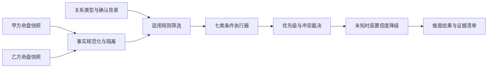

# M4-2 合盘规则引擎实施说明

> 完成日期：2026-08-15  
> 状态：已完成  
> 方法论版本：`heming-method-v1`  
> 范围：双盘事实提取、条件执行、冲突裁决、证据链和分维度结果

## 1. 阶段目标

M4-2 把 M4-0 的自然语言方法论和结构化规则契约转换成确定性的程序执行结果。程序只负责读取允许的命盘事实并触发规则，AI 仍然只负责后续解释，不能自行补算规则事实。

本阶段不实现聊天持久化、不修改合盘工作台，也不生成合盘报告；这些分别属于 M4-3 和 M4-4。

## 2. 执行流程



相同命盘快照、关系背景、方法论版本和命盘引擎版本会生成完全相同的 JSON 结果。引擎不使用时间戳、随机编号或模型输出。

## 3. 双盘事实提取

`lib/heming/facts.ts` 将完整命盘压缩成规则允许读取的事实子集：

- A/B 身份；
- 出生时辰是否确认；
- 十二宫规范名称、地支、星曜、固定本命四化和空宫状态；
- 当前大限所在宫位和年龄范围。

事实层明确排除：

- 宫干自化；
- 跨盘飞化；
- 来因宫；
- 模型补算事实；
- 未确认现实事件。

### 3.1 宫位名称规范化

项目实际排盘返回“夫妻、财帛、官禄、仆役”等名称，方法论统一使用“夫妻宫、财帛宫、官禄宫、交友宫”。事实层执行唯一规范化：

- 普通宫位统一补“宫”；
- `仆役`、`仆役宫`、`交友`统一为`交友宫`；
- 未识别或缺失宫位直接报错，不静默推断。

这样规则定义不需要同时维护多套名称，也避免“仆役”和“交友”被当成两个不同宫位。

## 4. 条件执行器

引擎完整支持 M4 v1 的七类条件：

| 条件 | 执行含义 |
| --- | --- |
| `star_overlap` | 比较两个跨盘宫位中指定星曜类别的名称交集 |
| `star_category_count` | 统计指定宫位的主星、吉曜或煞曜数量 |
| `natal_sihua_present` | 检查星曜自带的固定本命禄权科忌，不读取宫干自化 |
| `palace_empty` | 使用排盘空宫标记，缺失时按是否存在主星确定 |
| `birth_time_known` | 检查该方是否明确标记未知时辰 |
| `stage_focus_in` | 检查当前大限宫位是否位于规则允许集合 |
| `confirmed_context_present` | 只读取用户保存的主要关注、角色、自定义关系和确认事实 |

同一条规则的条件按 AND 关系执行，任一条件不满足即不触发。

## 5. 优先级和冲突裁决

同时触发规则时按以下顺序排序：

1. 信息不足保护规则；
2. A、B、interaction 证据更完整的规则；
3. 双向星曜对应规则；
4. 只适用于单一关系类型的具体规则；
5. 规则声明的优先级；
6. 规则编号，作为最终确定性排序。

发生 `conflictsWith` 冲突时只保留排序更高的规则，同时在 `suppressedRules` 中记录被压制规则、胜出规则和原因。例如双向伴侣期待对应与单向对应同时满足时，只保留双向结果。

没有冲突声明的支持性、压力性和观察性结果可以同时存在，不做正负抵消。

## 6. 未知时辰降级

M4-2 增加了甲乙双方对称的未知时辰保护规则：

- `unknown-time-confidence-guard`
- `unknown-time-confidence-guard-b`

只要某方时辰未知：

- 对应保护规则输出 `insufficient`；
- 引用该方命盘的其他结论置信度统一降为 `low`；
- 被降级结果记录 `degradedByRuleIds`；
- 警告列表说明是哪一方时辰未确认。

为了兼容 M4-1 已经创建的会话，评估服务会把独立保存的 `birth_info_a_json`、`birth_info_b_json` 合并回旧命盘快照。新生成命盘也会直接保留 `unknownTime`。

## 7. 证据链

每条触发结果都包含可回溯证据编号。证据记录：

- A、B 或 interaction 归属；
- 命盘、规则引擎或用户确认来源；
- 事实类型、宫位、地支、星曜或四化；
- 方法论版本；
- 命盘引擎版本；
- 规则编号和规则版本；
- 证据置信度。

跨盘规则会保留双方原始证据，并生成一条 `rule_engine` interaction 证据，interaction 不会脱离 A/B 原始证据单独出现。

## 8. 输出结构

`HemingEvaluationResult` 包含：

- `methodologyVersion` 和 `chartEngineVersion`；
- 关系类型与双方角色；
- 身份隔离的 `facts.A` 和 `facts.B`；
- 去重后的证据清单；
- 每个关系维度的本命结果和阶段结果；
- 最终触发规则；
- 被冲突裁决压制的规则；
- 未知时辰、缺失大限和缺失现实背景警告。

输出明确不包含 `score` 或任何单一匹配总分。

## 9. 服务与 API

新增只读接口：

```text
GET /api/conversations/[id]/heming-evaluation
```

接口只接受已保存的 `heming` 会话编号，服务端读取双命盘、关系类型和背景后执行规则。单盘会话、缺失双命盘或不存在的会话会返回明确错误。

服务端模块通过 `lib/heming/service.ts` 直接导入，不从客户端共享 barrel 导出，避免把 SQLite 和 Node 模块打入浏览器包。

## 10. 自动化验证

`scripts/test-heming-engine.ts` 覆盖：

- A/B 原始事实隔离；
- 原始宫名到规范宫名映射；
- 禁用的宫干自化不会进入事实；
- 七类条件的命中和未命中；
- A/B 交换后的对称规则；
- 双向规则压制单向规则；
- 甲方和乙方未知时辰保护；
- 旧命盘快照未知时辰兼容；
- 阶段变化不修改本命基线；
- 相同输入输出完全一致；
- 重要结果可以回溯规则和证据；
- 输出不存在总分；
- SQLite 会话评估服务集成。

此外使用端口 30001 的真实接口完成了生成双盘、创建临时合盘、读取规则评估和删除临时记录的完整回归。

## 11. 下一阶段

M4-3 将以本阶段结构化结果为权威输入，开发：

- 双命盘 Context Builder；
- 合盘消息持久化和自动上下文压缩；
- 固定高度聊天工作台；
- 甲乙双盘对照和维度结果展示；
- 现实背景补充确认；
- AI 只能解释规则结果、不能修改事实的提示约束。
