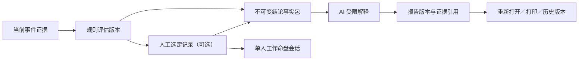

# M5-5 出生时辰校时结论报告实施说明

> 完成时间：2026-08-16
> 范围：校时结论事实包、AI 解释边界、报告版本、证据审计、工作命盘创建

## 1. 阶段结果

M5-5 完成了从“规则评估结果”到“可长期保存的正式结论”的最后一段闭环。用户可以在校时工作台进入结论报告中心，生成、重新打开、切换版本、打印报告，并从当前人工选定的候选创建普通单人命盘会话。

整个流程坚持两个边界：

1. 排名、相对证据指数、置信度、并列状态和稳定性只能由确定性规则引擎产生。
2. AI 只能解释服务端提供的事实包，不能补算、改分或把相对指数描述成真实概率。

## 2. 端到端流程

当事件证据发生变化时，旧评估会立即标记为非当前状态。系统会阻止继续生成新报告或创建工作命盘，直到用户重新评估并再次确认候选。已经完成的旧报告不会被删除，仍可作为当时判断的审计记录。

## 3. 不可变事实包

`buildRectificationReportFacts` 只读取已经落库的校时会话、当前评估、事件矩阵和人工选定记录，生成以下内容：

- 评估 ID、版本、方法论版本和评估引擎版本。
- 所有独立候选的时段、命宫、身宫、五行局和命宫主星。
- 候选排名、并列状态、相对证据指数、置信度、支持数和冲突数。
- 留一事件检验结果、顶部差距、证据就绪度和警告。
- 用户确认且允许评分的人生事件。
- 区分性规则命中和明确冲突。
- 当前人工选定记录及补充说明；未选定时保持为空。

事实包会与评估输入指纹、评估 ID 和选定记录 ID 一起生成报告输入指纹。只要这些输入没有变化，普通“生成”请求复用已完成版本；“重新生成”才会创建新版本。

## 4. AI 解释约束

提示词采用白名单输入：模型只能看到事实包和带 ID 的证据清单。输出必须是合法 JSON，并完整包含五个固定章节：

1. 核心候选结论。
2. 主要区分证据。
3. 冲突证据与结论边界。
4. 候选比较。
5. 后续验证建议。

服务端再次校验章节 key、标题和证据 ID；不存在于输入白名单的引用会被过滤。摘要开头由服务端写入不可变的排序、选定、事件数量、类别数量和稳定性快照；报告免责声明同样由服务端固定写入，不接受模型覆盖。就绪度被拆成四个独立真假项，防止模型把“事件数未达推荐”错误扩展成“类别数也未达推荐”，明显矛盾的行动建议会被过滤。

## 5. 数据库设计

SQLite 第 13 版迁移新增：

- `rectification_reports`：每个校时会话一条报告主记录。
- `rectification_report_versions`：保存评估版本、选定记录、输入指纹、模型配置、生成状态和 token 用量。
- `rectification_report_evidence`：按报告章节保存实际引用的结构化证据。
- `rectification_conversation_links`：保存选定记录与普通单人命盘会话之间的一对一关系。

新版本生成失败只记录失败状态，不会覆盖 `active_version_id` 指向的旧有效版本。

## 6. 工作命盘创建

工作命盘入口只接受当前校时会话 ID，不接受客户端提交任意候选 ID。服务端必须确认：

- 当前证据已有最新评估。
- 校时会话已经人工选定候选。
- 选定记录属于当前评估版本。
- 候选属于当前校时会话。

创建时直接使用候选中已保存的命盘快照和出生信息，不重新猜测时辰。同一选定记录与普通命盘会话保持一对一；重复点击返回已有会话，避免生成重复历史。

## 7. 页面与接口

页面：

- `/rectification/[id]/reports`：报告中心和生成条件状态。
- `/rectification/[id]/reports/[reportId]`：报告详情、版本切换、重新生成、打印和进入工作命盘。

接口：

- `GET/POST /api/rectifications/[id]/reports`
- `GET /api/rectification-reports/[reportId]`
- `POST /api/rectification-reports/[reportId]/regenerate`
- `POST /api/rectifications/[id]/conversation`

## 8. 自动化验证

`npm run test:rectification-report` 覆盖：

- 事实包只包含独立候选和当前证据。
- 提示词禁止模型改写排名、指数和稳定性。
- 固定章节与证据白名单校验。
- 报告缓存、并发认领、重新生成和失败回退。
- 报告版本与评估、选定记录的绑定。
- 工作命盘幂等创建。
- 证据变化后的旧评估失效保护。
- SQLite 第 13 版迁移。

## 9. M5 阶段完成

M5-0 至 M5-5 已形成“方法论边界 → 候选生成 → 事件事实 → 规则排序 → 比较选定 → 结论报告 → 工作命盘”的完整可追溯闭环。

按产品路线图，下一阶段进入 M6 紫微学习模式。第一步建议先实现“命盘结构讲解模式”：基于用户当前命盘选择宫位或星曜，展示知识卡、当前命盘实例、依据来源和小测验，不混入个性化吉凶断言。
