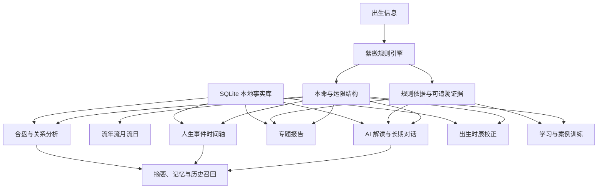
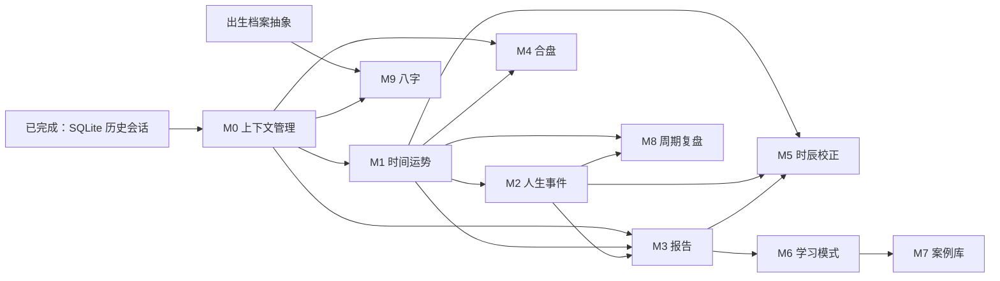

# 紫微斗数 AI 产品后续模块开发规划

> 文档状态：产品与技术规划初稿，可作为后续迭代总纲  
> 编写日期：2026-08-13  
> 适用项目：ziweidoushu 本地部署版  
> 关联文档：[AI 对话持久化与上下文管理设计](./AI_CONTEXT_MANAGEMENT_DESIGN.md)

---

## 1. 文档目的

本文规划项目在“紫微命盘生成与 AI 解读”基础上的后续产品模块，明确各模块的产品目标、用户流程、业务规则、数据要求、技术依赖、AI 职责、页面与接口、实施顺序和验收标准。

本文主要解决以下问题：

1. 项目后续应该开发哪些模块。
2. 哪些模块最适合复用当前紫微命盘能力。
3. 哪些计算必须由确定性算法完成，不能交给 AI 猜测。
4. 各模块之间存在什么依赖关系。
5. 应该按照什么顺序开发，避免重复建设。
6. 每个模块做到什么程度才算可以交付。

本文不是一次性要求全部实现，而是未来多个版本的开发路线图。

---

## 2. 产品定位

项目不应只被定义为“一次性在线算命页面”，建议逐步升级为：

> 以紫微斗数确定性排盘为基础，结合长期对话记忆、人生事件、流年分析、关系分析与传统文化知识学习的本地个人命理研究工具。

产品价值由四部分构成：

1. **算得出来**：算法生成命盘、宫位、星曜、四化、大限与流年等结构化结果。
2. **讲得清楚**：AI 将结构化结果解释成普通用户可以理解的中文。
3. **记得住**：系统保存命盘、对话、现实事件、用户确认事实和历史报告。
4. **可以验证**：用户能够用过去事件回看命盘判断，而不是只接受不可追溯的结论。

产品始终需要展示明确说明：所有命理解读仅用于传统文化学习和个人反思，不替代医疗、法律、投资、心理咨询及其他专业建议。

---

## 3. 当前项目能力基线

### 3.1 已具备能力

- 公历出生信息输入与真太阳时校正。
- 紫微命盘生成。
- 十二宫、主星、辅星、煞星、四化、空宫借对宫。
- 大限数据与当前大限识别。
- 本命、大限、流年切换界面。
- 命宫、三方四正、格局和倪海夏体系知识数据。
- 单盘 AI 流式解读与专题追问。
- 初步合盘页面和合盘接口。
- 古籍库、知识库和搜索页面。
- SQLite 会话、消息与命盘快照持久化。
- 历史会话列表、刷新恢复、重命名与删除。
- 单盘流式消息分批保存。

### 3.2 尚未完成的基础能力

- 动态 Token 预算和完整 Context Builder。
- 增量滚动摘要。
- 结构化关键记忆。
- FTS5 历史召回。
- 合盘会话持久化。
- 流月、流日确定性排盘。
- 人生事件时间轴。
- 报告生成和导出。
- 出生时辰校正。
- 学习练习和案例评测。
- 八字、奇门、六爻等独立算法体系。

### 3.3 当前技术约束

- 当前按本地单机部署设计，暂不考虑用户账号和多租户。
- SQLite 是本地事实来源。
- 模型供应商可能切换，因此业务状态不能绑定单一模型厂商。
- 命盘计算结果必须由程序生成，不能由 AI 编造。
- 大型数据集目录不应进入常规运行时扫描和请求链路。

---

## 4. 总体产品架构



整体结构分为五层：

1. **确定性计算层**：排盘、运限、宫位关系、四化和规则评分。
2. **业务数据层**：命盘、事件、报告、会话、记忆和案例。
3. **AI 解释层**：上下文构建、解释、总结和自然语言问答。
4. **产品交互层**：命盘、时间轴、报告、合盘和学习页面。
5. **验证与安全层**：依据追溯、测试、免责声明、错误降级和隐私控制。

---

## 5. 开发原则

### 5.1 程序计算，AI 解释

以下内容必须由确定性程序生成：

- 历法转换
- 命宫、身宫
- 星曜落宫
- 四化映射
- 大限、流年、流月、流日结构
- 三方四正和对宫关系
- 合盘宫位对应关系
- 候选时辰命盘
- 规则评分和命中依据

AI 可以负责：

- 将结构化数据转换为自然语言
- 根据用户问题选择解释重点
- 对已有结论进行摘要
- 整理用户明确陈述的事实
- 生成报告草稿
- 提供学习反馈

AI 不可以负责：

- 凭空生成命盘数据
- 猜测用户没有说过的现实经历
- 将未验证推断写成确定事实
- 代替专业人士给出医疗、投资或法律结论

### 5.2 原始数据永久保存，派生结果可重建

原始命盘、用户消息和用户录入事件属于事实数据。摘要、评分、AI 报告和推荐属于派生数据。

派生数据必须保留版本和来源，必要时可以根据原始数据重新生成。

### 5.3 先完成紫微主线，再扩展其他术数

紫微模块可以最大程度复用当前代码。八字、奇门、六爻和梅花易数需要新的规则引擎、数据模型与测试体系，不应当作为紫微页面上的简单 AI 提示词功能直接上线。

### 5.4 每条结论尽量可追溯

报告或解读的重要结论应尽量附带依据，例如：

- 来源宫位
- 相关星曜
- 四化类型
- 所属大限或流年
- 命中的规则编号
- 参考知识条目

### 5.5 本地优先和隐私最小化

- 个人事件和完整对话默认只保存在本地 SQLite。
- 只向模型发送本次问题需要的数据。
- 支持删除会话、报告和人生事件。
- 后续如增加云同步，需要作为独立版本重新设计权限和隐私。

---

## 6. 模块优先级总览

| 编号 | 模块 | 优先级 | 价值 | 技术复杂度 | 前置依赖 |
|---|---|---:|---:|---:|---|
| M0 | 上下文管理基础设施 | P0 | 很高 | 高 | 历史会话已完成 |
| M1 | 流年、流月、流日分析 | P0 | 很高 | 中高 | 紫微规则引擎、M0 |
| M2 | 人生事件时间轴 | P0 | 很高 | 中 | SQLite、M1 |
| M3 | 专题报告与年度报告 | P1 | 高 | 中 | M0、M1、M2 |
| M4 | 合盘与关系分析 | P1 | 高 | 高 | 双命盘规则、M0 |
| M5 | 出生时辰校正 | P1 | 很高 | 很高 | M1、M2、规则评分 |
| M6 | 紫微学习模式 | P2 | 中高 | 中高 | 知识库、依据系统 |
| M7 | 匿名案例库与命盘对比 | P2 | 中 | 高 | M2、M6、数据治理 |
| M8 | 主动提醒与周期复盘 | P2 | 中 | 中 | M1、M2、报告 |
| M9 | 八字体系 | P3 | 高 | 很高 | 独立算法和知识库 |
| M10 | 奇门、六爻、梅花、择日 | P4 | 可选 | 很高 | 各自独立引擎 |

优先级说明：

- **P0**：主线基础，应该最先完成。
- **P1**：形成产品差异化的核心模块。
- **P2**：增强留存、学习价值和内容深度。
- **P3/P4**：跨体系扩展，必须在紫微主线稳定后再立项。

模块依赖关系：



---

## 7. M0：上下文管理基础设施

> 实施状态（2026-08-13）：单盘 Context Management v1 已完成；双人合盘上下文留待 M4 接入。

### 7.1 产品目标

让用户在几十轮甚至上百轮对话中继续获得连贯、成本可控、事实不混乱的回答，为所有后续模块提供统一 AI 记忆能力。

### 7.2 用户价值

- 早期说过的重要信息不会轻易遗忘。
- 不必每次重新介绍职业、婚姻和关注重点。
- AI 能区分用户事实、命盘事实和历史推断。
- 长对话不会无限增加 Token。

### 7.3 功能范围

1. Context Builder。
2. 动态 Token 预算。
3. 最近消息窗口。
4. 增量滚动摘要。
5. 结构化关键记忆。
6. FTS5 历史召回。
7. 上下文运行记录。
8. 摘要和记忆重建。

详细设计以 `AI_CONTEXT_MANAGEMENT_DESIGN.md` 为准。

### 7.4 新增数据

- `memory_items`
- `context_runs`
- `messages_fts`
- `conversations.summary_json`
- `conversations.summary_through_seq`

### 7.5 推荐页面能力

- 会话详情中的“记忆管理”抽屉。
- 查看已保存事实、用户偏好和待确认问题。
- 删除或纠正错误记忆。
- 开发模式下查看本次使用的上下文层。

### 7.6 验收标准

- 100 轮对话不会超过模型输入预算。
- 用户早期明确事实可以通过记忆或召回继续使用。
- AI 推断不会保存为用户确认事实。
- 摘要损坏后能够由原始消息重建。
- 上下文构建失败时能够降级到命盘事实和最近消息。

---

## 8. M1：流年、流月、流日分析

> 实施状态（2026-08-13）：第一版年度确定性快照、SQLite 缓存、年度分析页、AI 年份上下文及只读年度总结报告已完成。流月、流日仍待开发。实现细节见 `docs/M1_ANNUAL_TRANSIT_IMPLEMENTATION.md`。

### 8.1 产品目标

把当前简单的“本命、大限、流年”切换升级为完整的时间运势分析工具，让用户能够围绕某一年、某个月或某一天进行查询和回溯。

### 8.2 目标用户问题

- 2027 年适合换工作吗？
- 今年哪几个月事业压力较大？
- 今年什么时候适合搬家？
- 去年发生的变化在命盘上有什么对应？
- 当前阶段应该关注事业还是感情？

### 8.3 功能分层

#### 第一版：年度分析

- 年份选择。
- 所在大限。
- 流年命宫。
- 流年四化。
- 重点宫位。
- 事业、感情、财运、健康和家庭专题。
- 年度总览与行动建议。
- 保存年度分析记录。

#### 第二版：流月分析

- 月份选择。
- 流月宫位和四化规则。
- 月度主题与风险提示。
- 年度十二个月时间轴。
- 重要月份对比。

#### 第三版：流日分析

- 日期选择。
- 流日结构。
- 适合用于日记式观察，不输出绝对吉凶。
- 支持将现实事件记录到当天。

### 8.4 用户流程

1. 用户打开已保存命盘。
2. 切换到“时间”视图。
3. 选择年份、月份或日期。
4. 系统先计算确定性运限结构。
5. 页面高亮受影响的宫位和四化。
6. 用户选择专题或提出具体问题。
7. Context Builder 组装本命、当前运限、相关宫位和现实事件。
8. AI 生成解释并保存到当前会话或年度专题会话。

### 8.5 规则引擎要求

需要新增统一接口：

```ts
interface TransitContext {
  level: 'daxian' | 'year' | 'month' | 'day';
  date: string;
  palaceBranch: number;
  stemIndex: number;
  siHua: Record<string, '禄' | '权' | '科' | '忌'>;
  relatedPalaces: number[];
  evidence: RuleEvidence[];
}
```

每个计算结果必须带 `engineVersion`，避免规则升级后旧报告无法解释。

### 8.6 推荐数据表

`transit_snapshots`：

- `id`
- `conversation_id`
- `level`
- `target_date`
- `engine_version`
- `snapshot_json`
- `created_at`

只需要缓存已访问的运限结果，不必预先生成所有日期。

### 8.7 页面规划

- `/chart/[id]/timeline`
- 年、月、日三级时间导航。
- 命盘宫位高亮。
- 右侧显示当前时间结构和 AI 对话。
- 下方展示已记录事件和历史报告。

### 8.8 API 规划

- `GET /api/conversations/[id]/transits?date=2027-06-15&level=year`
- `POST /api/conversations/[id]/transit-reports`
- `GET /api/conversations/[id]/transit-reports`

### 8.9 验收标准

- 相同命盘、日期和引擎版本返回相同结构。
- 年度切换后宫位与四化展示同步变化。
- AI 请求只携带选定时间层级需要的数据。
- 历史年份可以保存报告并重新打开。
- 流月和流日没有完成确定性算法前，不允许只用提示词模拟上线。

---

## 9. M2：人生事件时间轴

> 实施状态（2026-08-13）：第一版手动事件 CRUD、日期精度、分类筛选、JSON 导出、年度运势自动关联和时间轴页面已完成。聊天候选事件提取、确认流程、事件上下文注入和事件 AI 回溯仍待开发。实现细节见 `docs/M2_LIFE_EVENTS_IMPLEMENTATION.md`。

### 9.1 产品目标

让用户把真实人生经历与命盘的大限、流年联系起来，形成长期可回顾、可验证的个人观察档案。

### 9.2 事件类型

- 学业
- 工作与创业
- 财务
- 感情与婚姻
- 生育与亲子
- 搬迁与出行
- 家庭事件
- 健康事件
- 奖项与重要成果
- 用户自定义类型

### 9.3 事件字段

```ts
interface LifeEvent {
  id: string;
  conversationId: string;
  title: string;
  category: string;
  startDate: string;
  endDate?: string;
  datePrecision: 'day' | 'month' | 'year' | 'range' | 'unknown';
  description?: string;
  impactLevel: 1 | 2 | 3 | 4 | 5;
  source: 'user_input' | 'conversation_extracted';
  sourceMessageId?: string;
  confirmedByUser: boolean;
  createdAt: number;
  updatedAt: number;
}
```

### 9.4 核心功能

1. 手动新增、编辑和删除事件。
2. 从聊天中识别候选事件，但必须由用户确认后写入。
3. 事件自动挂接对应大限、流年和流月。
4. 时间轴按年龄或自然年份展示。
5. 点击事件查看当时命盘结构和历史解读。
6. 支持事件标签和筛选。
7. 支持导出本地 JSON。

### 9.5 AI 职责边界

AI 可以从用户话语中提取候选事件：

> 用户说：“我 2021 年从北京去了上海工作。”

系统可以建议保存：

- 日期：2021 年
- 类型：工作、搬迁
- 内容：从北京到上海工作

但必须显示确认界面。用户确认前不能成为长期事实。

### 9.6 数据表

`life_events`：保存原始事件。  
`event_transit_links`：保存事件和运限快照之间的关系。  
`event_ai_analysis`：保存某次 AI 回溯分析，属于派生数据。

### 9.7 页面规划

- `/chart/[id]/events`
- 横向年份轴或纵向年龄轴。
- 顶部筛选事件类型。
- 右侧事件编辑抽屉。
- 点击年份可以同时查看流年结构。

### 9.8 验收标准

- 用户能够录入只有年份、年月或完整日期的事件。
- AI 自动提取的事件必须经过确认。
- 删除事件不会删除原始聊天消息。
- 事件能够正确映射到对应大限和流年。
- 时间轴可以处理同一年多个事件。

---

## 10. M3：专题报告与年度报告

> 实施状态（2026-08-14）：第一版已完成单人命盘七类专题报告、版本历史、结构化依据、失败不覆盖旧版本和浏览器打印导出；服务端 PDF 文件、版本差异比较留待后续增强。年度报告复用 M1，合盘报告与时辰校正报告分别留待 M4、M5。

### 10.1 产品目标

把零散聊天升级为结构稳定、可保存、可重建、可导出的正式分析成果。

### 10.2 报告类型

- 命格总览报告
- 性格与天赋报告
- 事业发展报告
- 感情婚姻报告
- 财富模式报告
- 健康关注报告
- 当前大限报告
- 年度运势报告
- 合盘关系报告
- 时辰校正报告

### 10.3 报告结构

每份报告建议包含：

1. 报告信息和生成时间。
2. 使用的命盘快照与引擎版本。
3. 核心结论摘要。
4. 结构化命盘依据。
5. 分主题详细分析。
6. 用户已确认现实背景。
7. 当前阶段与行动建议。
8. 未确认推断和待观察事项。
9. 文化参考与免责声明。

### 10.4 报告生成流程

1. 用户选择报告类型和时间范围。
2. 系统生成报告数据清单。
3. Context Builder 构建专用上下文。
4. AI 按固定 JSON Schema 输出章节内容。
5. 服务端校验结构和引用依据。
6. 渲染成网页报告。
7. 用户确认后保存版本。
8. 可选导出 PDF。

### 10.5 报告版本管理

报告不是简单覆盖：

- 每次重新生成产生新版本。
- 保存使用的模型、提示词、引擎和上下文摘要。
- 用户可以比较两个版本。
- 命盘规则升级后提示“此报告使用旧引擎生成”。

### 10.6 数据表

`reports`：报告主记录。  
`report_versions`：不同版本内容。  
`report_evidence`：章节与命盘依据映射。  
`report_exports`：导出文件元数据。

### 10.7 页面与接口

- `/chart/[id]/reports`
- `/chart/[id]/reports/[reportId]`
- `POST /api/conversations/[id]/reports`
- `GET /api/reports/[reportId]`
- `POST /api/reports/[reportId]/regenerate`
- `GET /api/reports/[reportId]/export?format=pdf`

### 10.8 验收标准

- 报告可以刷新恢复。
- 每条重要结论至少关联一个结构化依据或明确标记为综合推断。
- 报告生成失败不会覆盖旧版本。
- PDF 内容与网页报告一致。
- 报告不得包含用户未确认的现实事实。

---

## 11. M4：合盘与关系分析

> 实施状态（2026-08-15）：M4-0 至 M4-3 已完成。现已支持双盘事实隔离、宫位规范化、可审计规则、双命盘上下文、持久化多轮对话、自动摘要与记忆、关系背景更新、双盘对照和固定高度聊天区。下一步进入 M4-4 合盘报告。

### 11.1 产品目标

将现有一次性合盘升级为可以保存双方命盘、持续对话和按关系类型分析的完整模块。

### 11.2 支持关系类型

- 情侣和夫妻
- 商业合伙人
- 亲子
- 上下级
- 朋友
- 其他自定义关系

### 11.3 核心功能

1. 保存甲乙双方出生信息和命盘快照。
2. 选择关系类型。
3. 双方命宫、夫妻宫、官禄宫等专题映射。
4. 优势互补分析。
5. 冲突来源分析。
6. 沟通建议和边界建议。
7. 双方当前大限和流年关系。
8. 合盘历史会话。
9. 合盘专题报告。

### 11.4 不同关系的上下文选择

#### 感情关系

- 双方命宫
- 双方夫妻宫
- 福德宫
- 迁移宫
- 相关四化
- 当前大限

#### 商业合伙

- 双方命宫
- 官禄宫
- 财帛宫
- 交友宫
- 迁移宫
- 风险偏好和现实分工

#### 亲子关系

- 父母一方的子女宫
- 子女一方的父母宫
- 双方命宫和福德宫
- 沟通方式和成长阶段

### 11.5 重要业务规则

- 两张命盘必须分别标识，不可混合字段。
- 关系结论必须说明来自甲方、乙方或双方互动。
- 不输出“天生不合，必须分手”等绝对判断。
- 关系现实信息需要用户明确提供。
- 合盘数据默认不跨会话写入个人长期记忆，除非用户确认。

### 11.6 数据设计

可以复用 `conversations.type = heming`，并补齐：

- `birth_info_a_json`
- `birth_info_b_json`
- `chart_snapshot_a_json`
- `chart_snapshot_b_json`
- `relationship_type`
- `relationship_context_json`

如需支持多人关系，再升级为 `conversation_charts` 关联表，而不是继续增加 C、D 字段。

### 11.7 页面与路由

- `/heming`
- `/heming/[id]`
- 左侧合盘历史。
- 中间双命盘切换或对照。
- 右侧固定高度 AI 对话。
- 关系专题标签。

### 11.8 验收标准

- 合盘刷新后双方命盘和聊天完整恢复。
- 不同关系类型使用不同上下文模板。
- 页面明确标识甲方和乙方。
- AI 不会把甲方事实写到乙方名下。
- 可以生成和重新打开合盘报告。

---

## 12. M5：出生时辰校正

### 12.1 产品目标

帮助只知道大致出生时间的用户，通过多个候选命盘和已发生人生事件进行结构化比较，给出候选时辰排序和可追溯依据。

### 12.2 产品边界

时辰校正只能给出“候选匹配程度”，不能宣称绝对确定真实出生时辰。

### 12.3 用户流程

1. 用户输入确定的出生年月日和出生地。
2. 选择可能的时间范围或多个候选时辰。
3. 输入至少 3 个重要人生事件。
4. 系统为每个候选时辰生成命盘。
5. 系统把事件映射到对应大限和流年。
6. 规则引擎计算匹配分。
7. 展示候选排名、支持依据和冲突依据。
8. AI 用自然语言解释区别。
9. 用户选择某一候选作为当前使用时辰。
10. 系统保留校正记录，可以随新事件重新评估。

### 12.4 评分框架

总分不应由 AI 直接决定。建议包含：

```text
总匹配分
= 事件时间匹配
+ 事件主题宫位匹配
+ 四化关系匹配
+ 大限主题匹配
+ 多事件一致性
- 明显冲突扣分
```

每一个得分项需要：

- 规则编号
- 权重
- 命中的命盘结构
- 对应事件
- 支持或冲突类型

### 12.5 候选比较页面

- 候选时辰列表。
- 每个候选的命宫、身宫、主星和总分。
- 事件逐条对照矩阵。
- 支持依据与冲突依据。
- 两个候选命盘差异高亮。
- “设为当前命盘”按钮。

### 12.6 数据表

- `rectification_sessions`
- `rectification_candidates`
- `rectification_event_scores`
- `rectification_rule_hits`

### 12.7 风险

- 不同流派校时规则可能不同。
- 人生事件容易出现记忆偏差。
- 事件数量太少时结果不可靠。
- 评分权重需要通过真实案例不断校准。

### 12.8 验收标准

- 至少支持 2 到 12 个候选时辰比较。
- 每个候选分数能够展开查看依据。
- 事件不足时明确提示可信度较低。
- AI 只能解释规则评分，不能修改最终分数。
- 选择候选时辰不会删除原始命盘和校正历史。

---

## 13. M6：紫微学习模式

### 13.1 产品目标

把现有知识库和命盘交互升级为学习工具，服务想系统学习紫微斗数而不只是获取解读的用户。

### 13.2 学习内容结构

1. 基础概念：宫位、星曜、天干地支、五行局。
2. 十四主星。
3. 辅星、煞星。
4. 四化。
5. 三方四正。
6. 空宫借对宫。
7. 格局识别。
8. 大限与流年。
9. 综合解盘。
10. 案例练习。

### 13.3 核心功能

- 点击真实命盘进入解释模式。
- 高亮本宫、对宫和三合宫。
- 展示“为什么得出这个结论”。
- 古籍原文与现代解释对照。
- 章节式学习路径。
- 选择题、判断题和命盘题。
- 用户先自行解盘，AI 再给反馈。
- 错题本和学习进度。

### 13.4 AI 批改规则

AI 批改必须基于标准答案要点，而不是自由评价。

每道综合题应定义：

- 必须识别的宫位
- 必须识别的星曜
- 必须考虑的四化
- 可以接受的不同表述
- 常见错误
- 评分 Rubric

### 13.5 数据表

- `learning_courses`
- `learning_lessons`
- `learning_questions`
- `learning_attempts`
- `learning_progress`
- `learning_notes`

静态课程内容可以先保存在 TypeScript 或 Markdown 中，学习记录再放入 SQLite。

### 13.6 页面规划

- `/learn`
- `/learn/[course]`
- `/learn/[course]/[lesson]`
- `/practice`
- `/practice/[caseId]`

### 13.7 验收标准

- 学习内容可以追溯到知识条目或古籍来源。
- 练习题拥有结构化评分标准。
- AI 批改结果明确指出遗漏和错误依据。
- 学习进度可以刷新恢复。
- 不能使用未经核实的名人出生信息作为标准案例。

---

## 14. M7：匿名案例库与命盘对比

### 14.1 产品目标

通过真实、匿名、可追溯的案例帮助学习和验证规则，同时提供多个命盘或多个运限之间的结构化比较。

### 14.2 案例来源

- 项目维护者整理的公开案例。
- 用户主动导出的匿名案例。
- 获得明确许可的教学案例。
- 有可靠来源的历史人物资料。

### 14.3 禁止事项

- 未经用户确认自动公开本地命盘。
- 上传姓名、精确地点、联系方式等可识别信息。
- AI 编造名人出生时间。
- 将单个案例表述成普遍因果规律。

### 14.4 核心功能

- 按命宫主星、格局、四化和事件类型筛选。
- 两张命盘并列比较。
- 同一命盘不同年份比较。
- 相同格局不同人生经历比较。
- 案例依据和数据来源说明。
- 教学点评和讨论问题。

### 14.5 数据治理

案例数据必须区分：

- 原始来源
- 匿名化状态
- 授权范围
- 可公开字段
- 可信度等级
- 审核状态

### 14.6 验收标准

- 所有公开案例具有来源和授权状态。
- 导出匿名案例前显示字段预览。
- 精确出生信息默认不公开。
- 案例搜索结果可以追溯到原始案例编号。

---

## 15. M8：主动提醒与周期复盘

### 15.1 产品目标

让项目从“用户想起来才打开”升级为周期性自我观察工具。

### 15.2 本地部署适合的功能

- 每月复盘提醒。
- 生日前年度回顾。
- 进入新流年或新大限提示。
- 用户自定义事件周年提醒。
- 本地待办式提醒，不默认发送外部通知。

### 15.3 月度复盘模板

- 本月发生的重要事件。
- 事业、感情、健康和财务自评。
- 上月预测是否符合现实。
- 哪些结论需要修正。
- 下月观察重点。

### 15.4 价值

该模块的重点不是增加“预测次数”，而是积累可验证的长期数据，为时辰校正、报告和个人记忆提供更可靠的现实依据。

### 15.5 验收标准

- 提醒可以关闭。
- 本地环境未运行时不承诺实时通知。
- 复盘内容只有用户确认后才写入事件和记忆。
- 预测与现实反馈分开保存。

---

## 16. M9：八字体系

### 16.1 立项原则

八字不能被实现成“把生日交给 AI，让 AI 自己排八字”。必须建立独立确定性算法与知识系统。

### 16.2 功能范围

- 四柱排盘
- 藏干
- 十神
- 五行强弱
- 大运
- 流年
- 格局
- 用神与不同流派说明
- 八字专题对话
- 紫微与八字并列查看

### 16.3 与紫微复用部分

- 出生信息表单
- 真太阳时和历法基础
- SQLite 会话框架
- Context Builder
- 报告系统
- 人生事件时间轴
- 模型供应商适配

### 16.4 必须独立的部分

- 八字算法
- 八字领域模型
- 八字知识库
- 八字提示词
- 八字测试用例
- 八字规则证据

### 16.5 产品交互

建议在同一出生档案下建立多个“分析体系”，而不是把八字字段塞进紫微命盘 JSON：

```text
出生档案
  ├─ 紫微命盘
  ├─ 八字命盘
  └─ 后续其他体系
```

### 16.6 验收标准

- 使用公开可靠案例验证四柱和大运结果。
- 不同流派规则必须标注来源和版本。
- 紫微和八字的术语、事实和 AI 上下文不能混淆。
- 八字未通过算法测试前不得开放综合预测。

---

## 17. M10：奇门、六爻、梅花易数和择日

这些方向属于未来独立产品线，不建议同时启动。

### 17.1 奇门遁甲

适合具体时间和具体事项决策。需要：

- 阴遁阳遁
- 局数
- 九宫
- 八门、九星、八神
- 值符和值使
- 时间与方位
- 独立问题会话

### 17.2 六爻

适合围绕一个明确问题起卦。需要：

- 起卦方式
- 本卦、变卦
- 动爻
- 世应
- 六亲、六神
- 月建、日辰
- 用神判断

### 17.3 梅花易数

适合轻量即时占测。需要：

- 时间起卦
- 数字起卦
- 本卦、互卦、变卦
- 体用关系
- 五行生克

### 17.4 择日

适合婚礼、搬家、开业、签约和出行。需要：

- 目标事件类型
- 候选日期范围
- 历法和节气
- 冲煞与禁忌规则
- 用户出生信息
- 候选日期排序及依据

### 17.5 开发顺序建议

如果未来立项，建议顺序为：

1. 梅花易数轻量原型。
2. 六爻完整规则引擎。
3. 择日工具。
4. 奇门遁甲。

具体顺序仍应依据目标用户，而不是只看技术难度。

### 17.6 验收标准

- 每一种术数使用独立的起盘参数、规则引擎、术语字典和会话上下文，不能把不同体系的规则混入同一结论。
- 相同输入与相同规则版本必须得到完全一致的排盘结果；AI 只能解释已经计算出的结构化事实。
- 每次占测都保存问题、起盘方式、时间、地点、规则版本、结构化盘面和最终解读，刷新后能够完整恢复。
- 结论必须展示主要依据，并区分“规则事实”“流派解释”和“AI 建议”。
- 每个独立产品线在发布前，都要建立经过人工复核的基准案例集和自动回归测试。
- 未完成规则正确性验证的体系不得与紫微主产品共用“综合预测”入口。

---

## 18. 跨模块公共能力

### 18.1 出生档案

后续模块增多后，建议将出生信息从 `conversations` 中抽离为独立档案：

`profiles`：

- `id`
- `display_name`
- `birth_info_json`
- `created_at`
- `updated_at`

`charts`：

- `id`
- `profile_id`
- `system_type`
- `engine_version`
- `snapshot_json`
- `created_at`

这样同一人可以拥有紫微、八字和候选时辰等多个命盘，而会话只引用命盘 ID。

### 18.2 规则证据系统

建议统一：

```ts
interface RuleEvidence {
  ruleId: string;
  system: 'ziwei' | 'bazi' | 'qimen' | 'liuyao' | 'meihua';
  category: string;
  title: string;
  facts: Record<string, unknown>;
  sourceRefs: string[];
  engineVersion: string;
}
```

报告、AI 解读、学习题和校时评分都可以复用。

### 18.3 统一报告引擎

报告模块不应针对每种报告复制页面。建议使用：

- 报告模板
- 章节 Schema
- 数据提供器
- AI 章节生成器
- 证据校验器
- HTML 渲染器
- PDF 导出器

### 18.4 统一模型适配

所有模块统一使用模型能力描述：

- 上下文上限
- 最大输出
- 是否支持流式
- 是否支持 JSON Schema
- 是否支持提示缓存
- 模型名称和供应商

### 18.5 版本与迁移

所有重要派生数据至少记录：

- `engine_version`
- `prompt_version`
- `model_provider`
- `model_name`
- `generated_at`

---

## 19. 推荐导航与信息架构

本地版可以逐步形成以下结构：

```text
首页
├─ 新建命盘
├─ 我的命盘
│  └─ 命盘详情
│     ├─ 命盘
│     ├─ 对话
│     ├─ 时间运势
│     ├─ 人生事件
│     └─ 报告
├─ 合盘
├─ 出生时辰校正
├─ 学习
│  ├─ 课程
│  ├─ 练习
│  └─ 案例库
├─ 知识库
└─ 设置
   ├─ 模型配置
   ├─ 数据备份
   ├─ 隐私与删除
   └─ 引擎版本
```

在当前阶段不必立即重构全部路由。可以先在 `/chart/[id]` 内使用功能标签，待模块数量增加后再升级为嵌套路由。

---

## 20. 推荐数据库演进

### 20.1 第一阶段继续使用 SQLite

本地单机环境下 SQLite 足够支持：

- 多个命盘
- 数百个会话
- 数万条消息
- 人生事件
- 报告版本
- FTS5 搜索
- 学习记录

### 20.2 迁移策略

- 所有建表和字段修改必须通过迁移版本执行。
- 不在应用启动时直接假设新字段存在。
- 迁移前自动检查数据库版本。
- 复杂迁移前提供数据库备份。
- 测试使用独立临时 SQLite 文件。

### 20.3 备份与导入

建议增加：

- 导出完整 SQLite 备份。
- 导出单个命盘及相关数据为 JSON。
- 导入前预览内容。
- 版本不兼容时阻止导入并说明原因。

---

## 21. 开发里程碑

### 里程碑 A：长对话可持续

包含：

- Context Builder
- 动态 Token 预算
- 滚动摘要
- 关键记忆
- FTS5 召回

完成标志：长对话在预算内保持事实连续性。

### 里程碑 B：时间运势与现实事件

包含：

- 年度分析
- 流月第一版
- 人生事件时间轴
- 运限与事件关联

完成标志：用户可以选择年份、查看结构、记录并回顾现实事件。

### 里程碑 C：可交付报告

包含：

- 报告模板
- 命格和年度报告
- 证据映射
- HTML 与 PDF 导出

完成标志：报告可以保存、重建、导出和追溯依据。

### 里程碑 D：关系与校时

包含：

- 合盘持久化
- 关系类型模板
- 合盘报告
- 时辰校正原型

完成标志：合盘可持续对话，候选时辰可以按规则解释排名。

### 里程碑 E：学习平台

包含：

- 课程结构
- 交互式命盘教学
- 练习和评分
- 匿名案例库

完成标志：用户可以完成一条学习路径并获得可追溯反馈。

### 里程碑 F：跨体系验证

包含：

- 出生档案抽象
- 八字确定性引擎
- 八字独立上下文和报告

完成标志：八字通过算法测试并与紫微数据严格隔离。

### 粗略工作量估算

以下估算以一名熟悉当前项目的全栈开发者持续投入为参考，只用于规划顺序，不是交付承诺。算法资料整理、案例核验和产品反馈可能显著改变周期。

| 工作包 | 粗略周期 | 主要不确定性 |
|---|---:|---|
| M0 上下文管理完整落地 | 2-4 周 | 摘要质量、中文召回效果、不同模型 Token 计算 |
| M1 年度分析 | 2-3 周 | 流年规则核验和证据结构 |
| M1 流月与流日 | 4-8 周 | 流派规则、历法边界和测试案例 |
| M2 人生事件时间轴 | 2-4 周 | 交互设计、模糊日期和事件确认流程 |
| M3 报告与网页版本 | 2-4 周 | 结构化输出和证据校验 |
| M3 PDF 导出 | 1-2 周 | 中文字体、分页和复杂命盘布局 |
| M4 合盘完整化 | 3-6 周 | 双命盘上下文、关系规则和事实隔离 |
| M5 时辰校正原型 | 4-8 周 | 评分权重和高质量验证案例 |
| M6 学习模式第一条课程 | 3-5 周 | 课程内容、题库和评分标准 |
| M7 案例库 | 4-8 周 | 来源、授权、匿名化和审核流程 |
| M8 本地周期复盘 | 1-3 周 | 本地提醒机制和产品边界 |
| M9 八字第一版 | 8-16 周 | 独立算法、流派差异和大规模测试 |

每个工作包应再拆为“算法或数据”“服务端”“前端”“测试与文档”四类任务，不能只按页面数量估算。

---

## 22. 建议的近期开发顺序

结合现有项目状态，接下来建议按以下顺序执行：

1. 实现 Context Builder 和动态 Token 预算。
2. 实现增量摘要、关键记忆和历史召回。
3. 整理并测试流年规则，建立 `TransitContext`。
4. 完成年度运势页面和年度专题对话。
5. 开发人生事件表和时间轴。
6. 将事件接入上下文和年度回溯。
7. 建设统一报告引擎，先上线命格与年度报告。
8. 迁移合盘到 SQLite 会话架构。
9. 开发时辰校正评分原型。
10. 最后启动学习模式和其他术数调研。

不建议现在立即同时启动八字、奇门和六爻，因为会分散对紫微主线的算法测试和产品打磨资源。

---

## 23. 测试策略

### 23.1 确定性算法测试

- 固定出生信息对应固定命盘快照。
- 固定年份对应固定流年结构。
- 四化映射表逐项测试。
- 大限边界年龄测试。
- 闰月、跨年和时区边界测试。
- 规则升级使用快照差异审查。

### 23.2 数据测试

- 会话、事件、报告级联关系。
- 删除和恢复行为。
- 数据库迁移。
- 导出和导入。
- 中文全文搜索。

### 23.3 AI 质量测试

构建固定评测集，检查：

- 是否引用了不存在的星曜。
- 是否混淆甲乙双方。
- 是否把 AI 推断写成用户事实。
- 是否遗漏用户明确限制。
- 是否超出 Token 预算。
- 是否给出绝对化高风险结论。

### 23.4 端到端测试

- 新建命盘到年度报告。
- 新增人生事件并在聊天中召回。
- 合盘创建、刷新和继续追问。
- 时辰候选比较与选择。
- 报告重新生成和旧版本保留。

---

## 24. 产品指标

本地部署版不一定需要上传分析数据，但可以在本地统计：

### 24.1 稳定性指标

- 页面刷新恢复成功率
- 流式消息完成率
- 数据库错误次数
- 报告生成失败率
- 上下文超限次数

### 24.2 AI 质量指标

- 关键事实召回率
- 命盘事实错误率
- 摘要事实错误率
- 甲乙双方混淆率
- 重要结论证据覆盖率

### 24.3 产品使用指标

- 每个命盘的对话轮数
- 人生事件记录数量
- 年度报告生成次数
- 历史会话重新打开次数
- 学习课程完成度

这些指标默认在本地保存。未经明确许可，不上传个人命盘和对话内容。

---

## 25. 主要风险与控制措施

### 25.1 规则准确性风险

控制措施：确定性算法、固定案例测试、引擎版本、来源说明和规则证据。

### 25.2 AI 幻觉风险

控制措施：结构化上下文、事实类型隔离、输出 Schema、证据校验和高风险措辞过滤。

### 25.3 长上下文成本与质量风险

控制措施：动态预算、摘要、关键记忆、按需召回和上下文运行记录。

### 25.4 隐私风险

控制措施：本地 SQLite、最小化发送、可删除、可导出、匿名案例显式授权。

### 25.5 过度产品承诺风险

控制措施：避免绝对预测，不使用“准确率百分之百”，强调文化研究和个人反思属性。

### 25.6 多流派混淆风险

控制措施：规则标明流派、来源和版本；不同流派不在同一结论中无说明地混用。

### 25.7 模块过度扩张风险

控制措施：按照 P0 到 P4 分阶段，每个模块通过验收后再启动下一个高复杂度体系。

---

## 26. 第一阶段明确不做的内容

- 用户注册、会员和支付。
- 多设备云同步。
- 社交社区和公开评论。
- 自动公开用户命盘。
- 实时外部消息推送。
- 同时开发多套术数算法。
- 用 AI 替代尚未实现的排盘规则。
- 医疗诊断、投资买卖或法律决策建议。

这些内容未来如果需要，应作为独立立项重新评估安全、法律和运维成本。

---

## 27. 模块完成定义

任何模块只有同时满足以下条件才算完成：

1. 产品流程可以从入口走到结果。
2. 刷新后数据可以恢复。
3. 确定性规则具有自动化测试。
4. AI 输入和输出边界清楚。
5. 错误状态和空状态可用。
6. 明暗模式和常见屏幕尺寸可用。
7. 数据可以删除或导出。
8. 重要结果能够追溯版本和依据。
9. 高风险内容带有适当说明。
10. 设计文档、接口和实际代码一致。

---

## 28. 最终推荐路线

本项目最值得形成的核心产品组合是：

```text
紫微确定性命盘
+ 长期对话记忆
+ 流年流月分析
+ 人生事件时间轴
+ 可追溯专题报告
+ 合盘关系分析
+ 出生时辰校正
```

这套组合的差异化不在于生成更多泛化的“算命文案”，而在于：

- 命盘由程序计算。
- 解读能够说明依据。
- 系统记得用户长期情况。
- 预测可以与现实事件回溯比较。
- 报告和历史可以持续积累。
- 用户始终拥有本地数据控制权。

当前最近的开发目标应当是 M0 上下文管理，然后进入 M1 年度分析与 M2 人生事件时间轴。三者完成后，项目才能从“一次性 AI 解盘页”真正发展为长期使用的个人命理研究产品。
